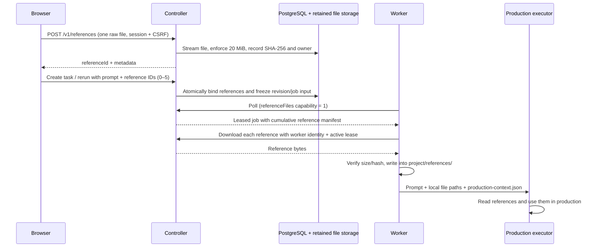

# Task reference files

Implemented in the Git worktree; this document does not assert a production deployment.

## User behavior

New task and Continue task accept an optional selection of any file type, including
images, logs, videos and binary files. The prompt remains required. Each submission
can add at most five files; each file may contain at most 20 MiB (20 × 1024 × 1024
bytes, displayed as 20 MB). Both browser and controller enforce these limits.
The browser shows names/sizes, removal controls and per-file upload status. A failed
upload preserves the selection and reuses already uploaded files when retried.

References belong to the task revision that supplied them. A continuation adds its
new references to the existing references; five is the limit for each submission,
not for the task's lifetime. A continuation with text only keeps previous references.
Names can repeat across files and revisions without overwriting their contents.
Task detail shows the references, source revision and authenticated download links.

## Data flow



The upload endpoint uses a raw request body instead of base64 or multipart. Files
are uploaded sequentially so a five-file selection does not buffer 100 MiB in the
browser or controller. `x-file-name` contains the percent-encoded original name;
`Content-Type` records the MIME type. The request stream is counted independently
of `Content-Length`, including chunked uploads. Oversized uploads receive HTTP 413.

`POST /v1/tasks` accepts `{ objective, references: [referenceId, ...] }`.
`POST /v1/tasks/:taskId/rerun` accepts `{ prompt, references: [referenceId, ...] }`.
Omitting `references` means no new files. IDs must be distinct, owned by the caller,
unbound and less than 24 hours old. Files cannot be claimed by two submissions.
Task creation, reference binding, revision input/hash and job creation are one
transaction. Each revision's `input.references` contains its new files;
`input.payload.references` and `jobs.payload.references` contain the cumulative
manifest. Each manifest item has `referenceId`, `name`, `contentType`, `sizeBytes`,
`sha256` and `taskRevision`. Filesystem storage paths and credentials are not sent.

Migration `008_task_references.sql` adds the metadata table, owner foreign key and
task/revision association. Files live under `ARTIFACT_ROOT/references` by default,
outside the checkout and installed release. Back up this directory together with
PostgreSQL and other retained artifacts. Unsubmitted uploads expire after 24 hours;
hourly cleanup removes expired pending records/files. Removing a staged file uses
`DELETE /v1/references/:referenceId`; it cannot delete a bound task reference.
Files already attached to tasks are retained across completion and cancellation.

`GET /v1/references/:referenceId` requires the owner's session and forces a download
with `nosniff` and a sandbox CSP. Uploaded HTML/SVG is not served as active content.
`GET /v1/worker/references/:taskId/:referenceId` requires worker authentication,
matching job/boot/token, a running task, an unexpired lease/deadline, and membership
in that job's frozen reference manifest. An old run cannot read a future revision's
references. Session/CSRF checks protect upload and removal operations.

## Worker use and compatibility

The agent advertises `capabilities.referenceFiles: 1`. The controller only leases
jobs with references to capable workers; text-only jobs retain compatibility.
Old workers leave attachment jobs queued until upgraded rather than executing
without their inputs. Deploy the worker update before enabling attachment use.

Before invoking the production harness, `executeJob` streams each missing file,
checks its exact size and SHA-256, and atomically places it at
`workspaces/<workspaceId>/project/references/<referenceId>.<safe-extension>`.
Original names remain in the manifest, never in filesystem paths. Existing files
are rehashed before reuse; missing/corrupt cache entries are downloaded again.
Directory links that escape the workspace are rejected. Downloads support abort
signals and bounded timeouts while the regular lease heartbeat remains active.
A failed download or integrity check prevents production execution.

The production prompt includes every local reference path, source revision and
metadata. `plan/production-context.json` carries the same manifest. The executor is
instructed to inspect images, read text/logs, inspect videos using available media
tools, treat file contents as data, preserve originals, and document their use.
Unsupported formats must be reported by the executor. Upload support does not imply
that every arbitrary binary format has an installed decoder.

## Verification and deployment

The controller-host code-boundary exception is limited to
`worker/agent/agent.mjs`, `worker/agent/references.mjs`,
`worker/agent/production-harness.mjs` and `worker/tests/references.test.mjs`.
The controller cannot materialize files in a worker workspace or provide its local
paths to the execution prompt; those receiving-interface changes are necessary.
No skills, root lockfiles, deployment releases or live runtime state are changed.

Verified on Linux using isolated PostgreSQL databases and a loopback HTTP server:

- Controller unit suite: 10 passed.
- Existing worker suite: 37 passed; four existing Windows-only cases skipped.
- New worker reference tests: 7 passed, covering safe paths, cache repair, integrity,
  cancellation, partial-file cleanup and blocking execution on corrupt bytes.
- New controller reference integration tests: 3 passed, covering upload boundaries,
  ownership, immutable binding, capability gating, authenticated worker downloads,
  continuation and expiration. They exercise `runAgent` → `executeJob` → production
  harness with a CLI probe that actually reads the local reference files from its
  working directory and verifies their paths are in the prompt. The probe deliberately
  does not produce a game; normal game acceptance fails as expected.
- Chromium browser probe: passed selection limits, removal, partial upload retry,
  create/reload, continuation, Unicode download names and mobile layout.
- Before pushing, rebased onto remote `fbd6990` to retain its three worker updates.
  Reference integration passed again on the combined code. The combined worker
  suite had 49 passes, four Windows-only skips and one archive test failure
  (`tar: .: file changed as we read it`). That failure was also reproduced on
  unmodified remote `fbd6990`; the attachment changes do not alter archive handling.
- Existing phase-1 integration suite: 17 other cases passed. The full suite is not
  green: `repeated progress snapshots collapse into one diagnostic` already fails
  at line 181 on unchanged HEAD (`2 !== 1`). Its unfinished fixture then causes
  later lease conflicts. The same failure was reproduced in a separate baseline
  checkout, and the remaining cases passed with only that case excluded.

Reproduction commands (PostgreSQL tests require a non-root user and readable checkout):

```bash
npm --prefix controller run test:unit
npm run test:worker
node --test controller/tests/references.test.mjs
node --test --test-skip-pattern='repeated progress snapshots' controller/tests/phase1.test.mjs
# Start an isolated dev server, then use its printed access file:
npm --prefix controller run dev
node controller/tools/verify-references-browser.mjs /path/to/dev/access.json
```

Windows execution was unavailable on this controller host. Before worker activation,
run `node --check worker/agent/references.mjs`, `npm run test:worker`, and the reference
integration probe on Windows to check native filesystem/rename/junction behavior.
No live Windows GPU job or real media decoding acceptance was run by these fixtures.

Deploy committed revisions only with the repository-owned controller and worker
Git scripts, recording each exact commit. Apply migration 008 through the normal
controller migration step. Wait for worker jobs/result delivery to finish before
upgrading; preserve journals, workspaces, allocations, reference files and artifacts.
No production deployment or schema migration was performed for this implementation.
