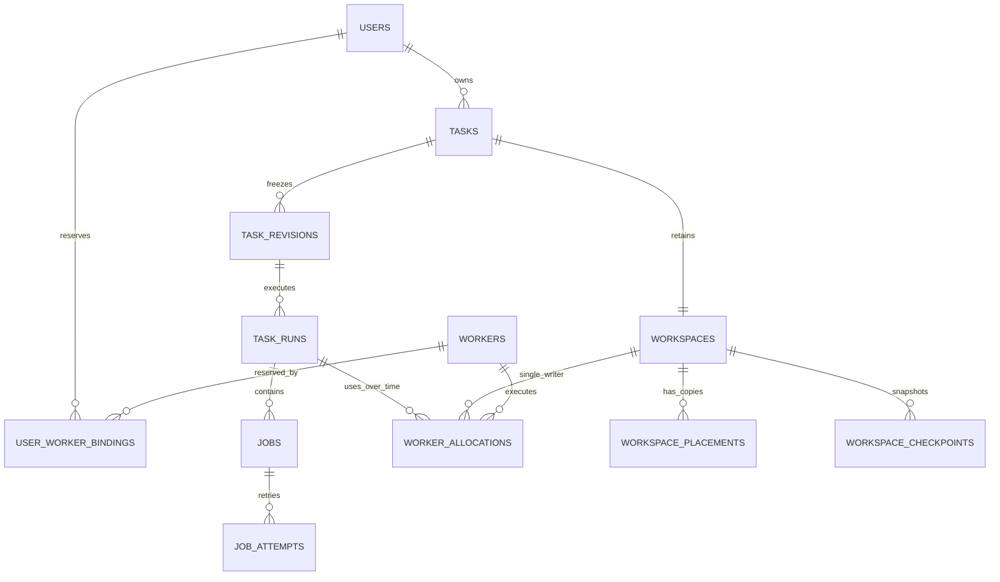

# Users, Workspaces and Worker Allocation

Status: Phase 1 implementation started in the repository; local verification recorded separately; Phase 2 remains future scope
Date: 2026-09-16
Baseline: [controller-worker-architecture.md](controller-worker-architecture.md)
Pilot evidence: [phase1-http-pilot-plan.md](phase1-http-pilot-plan.md#deployment-test-record)

## Recommendation

See [phase1-implementation.md](phase1-implementation.md) for implemented code, local verification and remaining gaps. The schema and APIs below describe the full target; only the first account/reliability/workspace foundation is implemented. No new deployment or production acceptance is claimed here.

Introduce invitation-based accounts, server-side sessions and an owner-scoped task list before the conversation workbench. Model a task's persistent workspace separately from its temporary worker allocation. The first scheduler may reserve one worker per user, but that reservation is a policy, not the task's identity or its only storage location.

Deliver this in increments: accounts and access control; persistent task/workspace identity with reliable execution; conversation and production orchestration on dedicated workers; checkpoint restore and elastic compute. Progress and artifact views can be implemented during the first two increments. Product work need not wait for cloud autoscaling. Existing Phase 1 cancellation, expiry and recovery gaps remain required work.

## Phase boundaries and current commitment

The current delivery target remains **Phase 1: internal testing with a limited number of invited users**. **Phase 2 means the later production launch**, including larger-scale resource management. Introducing accounts, reliable task control or an internal conversation workbench does not move the project into Phase 2.

| Concern | Phase 1: current internal-pilot target | Phase 2: future production target |
| --- | --- | --- |
| Users | Administrator-issued single-use invitations, a configured small account limit, simple login and owner-scoped tasks | Production account operations, abuse controls and higher-capacity admission |
| Worker capacity | Manually prepared/enrolled workers; dedicated user binding; one running task per user/worker | Shared eligible pool, cold start, quotas/fair scheduling and automated capacity management |
| Workspaces | Task-owned persistent local directories, placement records and verified local checkpoints | Independently durable checkpoints, cross-worker restore and automated retention |
| Reliability | Cancellation that actually stops execution, continuous heartbeats, expiry, same-worker recovery and stale-result rejection | Extend those guarantees through autoscaling, worker replacement and production failure/load cases |
| Frontend | Login, task list/detail, actual progress/artifacts, pause/resume; bounded conversation-driven game acceptance | Production-scale operation of the same task/workspace model |
| Transport/storage | Outbound polling, per-worker credentials, authenticated local artifacts; trusted HTTPS ingress for real account credentials | WSS/mTLS, OSS, provider lifecycle automation and production monitoring/hardening |
| Resource release | Release the execution slot after confirmed shutdown; retain workers and their local data | Automatic stop/recycle only after independently recoverable state and cleanup are verified |

The **current implementation round includes the cancellation and heartbeat fixes** together with the account/task-center and pinned-workspace foundations. These fixes are not postponed to cloud automation or hidden behind frontend work. The internal conversation/game-production acceptance remains Phase 1 work after those foundations. Phase 2 is design preparation only in this round.

Work packages `A`, `B` and `C` below all belong to Phase 1; `D` belongs to Phase 2. They are implementation packages, not additional product phases. Implement only the Phase 1 schema/adapter behavior needed now; specifying future provider operations does not require building them for the pilot.

### This round: cancellation and heartbeat fixes

The repository now implements cancellation and independent heartbeat/control, with local PostgreSQL and Windows process tests. Deployed GPU-stack verification remains open; see the implementation record. These gates cannot be closed using only the earlier remote smoke result.

| Required fix | Implementation contract | Acceptance evidence |
| --- | --- | --- |
| Effective cancellation | Persist cancellation intent atomically; running work enters `CANCELING`; an independent control loop delivers cancellation to the owning execution; stop the complete process tree, prevent later stages and confirm shutdown before `CANCELED` | Cancel a real/supervised long command; verify all descendants stopped, no later stage starts, the workspace remains retained and the task remains canceled after result replay |
| Continuous heartbeat | Run heartbeat, control polling and result replay independently of awaited tool execution; renew only the matching live lease; use bounded network timeouts/retries and avoid blocking the event loop during large-file work | During a command longer than one lease window and during artifact transfer, observe multiple heartbeats/renewals with no false expiry; cancellation still reaches the active process |

Canceling a queued task can transition directly to `CANCELED` after atomically preventing dispatch. For running work, HTTP 202 confirms the request, not process termination. A disconnected worker leaves cancellation pending/recovering until shutdown can be established; it must not be reported as stopped or immediately reused. Reconnection processes outstanding cancellation before scheduling more work.

Cancel and result handlers use the same lock order and legal transitions. A cancellation intent committed first rejects later `PASS` as task success; a completion committed first makes a later cancel request a no-op. Duplicate cancellation/acknowledgement is idempotent. Heartbeats from an old boot or allocation cannot renew a replacement lease or clear cancellation. On loss of renewal, the agent stops scheduling and stops the scoped process tree by the local lease deadline; the controller retains an uncertain worker in recovery until safe reuse is established.

Implement this first against the current HTTP controller/worker protocol with explicit matching job/lease identity, then preserve the behavior when the richer run/allocation schema lands. The fix does not require WSS, OSS, user-scale scheduling or a cloud provider adapter. Process-tree termination must be exercised on Windows; `child.kill()` of the wrapper alone is insufficient. The phase-1 task control UI must expose pending versus confirmed cancellation accurately.

Required regression cases: cancel/completion race in both orders, duplicate cancel, delayed success after cancel, child-process cleanup, long command heartbeat, heartbeat/control during upload, bounded network failure, controller restart with pending cancellation, and worker reconnect before result acknowledgement. Do not mark these passed based only on the existing smoke task or local protocol tests.

## Original smoke implementation

This section records the pre-account deployment reviewed at the start of the design. Its five-table description and limitations are historical; current source changes are listed in [phase1-implementation.md](phase1-implementation.md).

The current migration is [001_init.sql](../controller/deploy/migrations/001_init.sql). It defines five tables:

| Table | Current fields and meaning | Limitation |
| --- | --- | --- |
| `workers` | `worker_id`, status, capabilities JSON, Windows `session_id`, heartbeat timestamps | No distinct worker credential, boot identity, capacity reservation or cloud instance lifecycle |
| `tasks` | `task_id`, free-text `owner_id`, kind, objective, payload JSON, status, `worker_id`, deadline, result, timestamps | Owner comes from the request; no user FK, workspace, immutable revision or execution history |
| `jobs` | `job_id`, `task_id`, status, attempt counter, `worker_id`, `lease_until`, payload, result, timestamps | One job per submitted task; attempts overwrite fields; no fencing, renewal, reaper or durable result replay |
| `task_events` | Global `event_id`, `task_id`, event type, payload, timestamp | Coarse task events; no run/attempt correlation or worker-message deduplication |
| `artifacts` | `artifact_id`, task, name/type, local storage path, SHA-256, size, timestamp | Task association exists, but downloads currently bypass authentication and results do not validate referenced artifact ownership |

Current behavior follows directly from the API and agent:

- `PHASE1_TOKEN` grants shared browser access. `ownerId` is accepted from the browser and does not provide authorization. There is no login, registration, session or `GET /v1/tasks` list route.
- Any holder of the shared worker token can claim a `workerId`; the poller takes the next queued task without a user-to-worker policy.
- The browser remembers one task ID in local storage. It queries before a token is entered, stops on 401, and has no token-change handler to retry. A task list plus session bootstrap removes this dependency.
- Local workspace paths are reconstructed as `D:\YahahaGameWorker\workspace\<taskId>`. Actual project paths can point outside that directory. Neither the directory nor the project is a tracked workspace entity.
- Worker heartbeats share the loop that awaits the whole task. Cancellation only updates database rows, and late results can overwrite canceled state. Stored lease/deadline values alone do not implement recovery.
- The local file-based DAG and evidence modules are reference components; the HTTP API has not integrated them into the deployed execution path.

## Scope and assumptions

The first account release is an invited internal pilot. Each task is a long-lived user goal with its own conversation and workspace. A user can create multiple tasks; initially only one task per user and one task per worker may execute at a time. Multiple users may execute concurrently when they have distinct workers. A paused task retains its data and does not consume an execution slot after quiescence is confirmed.

There are no shared projects, organizations, billing system, arbitrary simultaneous project writers, or transparent process-memory migration in this release. Cross-task reuse is an explicit workspace fork from a checkpoint. A future shared-project feature can introduce project membership without changing task, run or worker IDs.

Registration does not promise immediate GPU capacity. An account without an assigned/available worker can save tasks; their runs show a specific resource-wait reason. Account creation never triggers an unbounded cloud allocation.

## Identity and access

### Invitation registration

An administrator creates a small batch of high-entropy, single-use invitation codes through an administrative CLI. Show each secret only at creation and store its digest. Suggested initial expiry is seven days, configurable. Do not include codes in source, URLs, analytics or logs.

Registration accepts a code, normalized username and password. Within one database transaction, serialize the configured internal-account admission-cap check, lock the matching invitation, verify it is unused/unexpired/unrevoked, create the unique user, mark the invitation redeemed by that user, and create the initial session. Roll back redemption if user creation fails or capacity is unavailable. Concurrent redemption of one code must produce exactly one account, and different codes cannot race past the account cap. Password hashing and basic validation can occur before the transaction; recheck admission and invitation under lock.

The invitation admits a new account. It is not a permanent password, a worker credential, or a task access key. A code may carry a server-authored entitlement or reserved-worker reference, but the registration client cannot select ownership or a worker. Invitations alone must not allow concurrent double-reservation of a worker.

### Login and sessions

- Start with username/password and administrator-assisted password reset. Use asynchronous Node `crypto.scrypt` with random salt, stored parameters and a versioned password-hash encoding. Benchmark parameters for this ECS and bound concurrent hashes; do not implement password hashing manually.
- Use random opaque server-side sessions, storing a token digest in PostgreSQL. Prefer this to introducing JWT refresh/revocation infrastructure. Rotate the token at login and revoke sessions on logout, account disable or password reset.
- Send a host-only `HttpOnly; Secure; SameSite=Lax; Path=/` cookie with explicit expiry. Suggested policy is seven-day absolute expiry and one-day idle expiry; expose no session secret to browser JavaScript or local storage.
- Check Origin and a session-bound CSRF token on state-changing requests. Registration/login also enforce allowed Origin and request format. Apply rate limits to login/registration and invitation attempts with generic authentication failures.
- Authenticate the worker independently with a per-worker secret or device certificate. Browser cookies and activation codes never authenticate a worker.

Real password/session access must use HTTPS on the public controller, or a trusted HTTPS private ingress. The existing public HTTP IP endpoint is not a credential deployment target. This moves TLS earlier than the rest of the Phase 2 transport/storage work; WSS, mTLS and OSS do not all need to land at once. Loopback-only development may use an explicitly configured insecure cookie.

### Owner authorization

The API obtains the owner from the authenticated session. Reject a client-supplied `ownerId` on new task creation. Every task detail/list/event/artifact/pause/resume/cancel/instruction route applies the same ownership check. Artifact access joins through the owning task; knowing an artifact ID is insufficient. Prefer a generic 404 for another user's resource.

An admin role supports account/invitation/worker operations, with explicit audited task access if needed. Do not silently grant all administrators normal read access through the member API. Session expiry stops browser access, not an already authorized job. Account suspension separately blocks new scheduling and lets an administrator explicitly decide the running job's disposition.

First-release downloads use authenticated same-origin streaming. Later, an authorized request may issue a short-lived signed object-store URL. Generated HTML/build content should download as an attachment or use an isolated preview origin; do not run task-supplied scripts on the account application's origin.

### Browser bootstrap

1. Load the static login/application shell and call `GET /v1/auth/me`.
2. On 401, render login or invitation registration and preserve the requested task route.
3. After login, fetch the authenticated task list; open an authorized selected task or the most recent task.
4. Fetch a task snapshot and connect to its SSE stream with an event cursor. Renew/reconnect independently of execution.
5. On logout/session expiry, close event connections, clear private page data, and return to login. Reauthentication restores the task list from the server.

Static HTML/CSS can be public because they contain no task data. All application data and actions require login. Local storage may remember a non-secret selected task ID, but it is neither an authorization source nor the task index. A different browser/device must see the same server-owned task list after login.

## Domain model



`taskId` is the stable user-visible goal. `workspaceId` is its persistent filesystem identity. `revisionId` freezes requirements and the plan. `runId` identifies an execution of that revision. `jobId` identifies a step and `attemptId` one attempt at that step. `allocationId` identifies a temporary grant of worker capacity and workspace write access.

Refreshing the browser creates none of these records. Resuming a paused, nonterminal run keeps task/workspace/revision/run IDs and obtains a new allocation/attempt where needed. A retry after a terminal failure/cancellation/expiry creates a new run. Changed requirements create a new immutable revision and run on the same logical workspace, based on an explicitly selected checkpoint. If a nonterminal run exists, record the new instructions but first quiesce and close that run as `CANCELED` with reason `SUPERSEDED` before creating its successor. No old terminal run is reopened or overwritten.

The first release enforces one workspace per task and one current nonterminal run per task. Multiple tasks for one user get separate workspaces even when they execute on the same worker. Cross-task workspace sharing is not implicit.

## Proposed schema and rollout

These are full-target logical schema specifications. The implemented subset is in `002_phase1_accounts.sql`; migrations have been exercised on isolated local databases, not applied to the ECS by this work. Preserve existing text IDs and use normalized columns for identity, ownership, leases and state; JSON remains appropriate for plans, capabilities and manifests.

| Table | Main columns/relationships | Increment |
| --- | --- | --- |
| `users` | `user_id`, unique normalized username, password hash, role, status, timestamps | A |
| `registration_invites` | `invite_id`, unique code digest, expiry/revocation, issuer, redeemed user/time; optional server-side reservation metadata | A |
| `user_sessions` | session ID, unique token digest, user FK, CSRF binding, idle/absolute expiry, revocation, timestamps | A |
| `tasks` (extend) | owner FK, `current_revision_id`, `current_run_id`, existing status as a projection, optimistic version | A ownership; B execution |
| `workspaces` | `workspace_id`, unique task FK, state, storage policy, monotonic `write_epoch`, latest verified checkpoint FK, retention policy | B |
| `task_revisions` | revision ID, task FK, revision number, immutable input/plan, hashes, creator/time | B |
| `task_runs` | run ID, task/revision/workspace FKs, status, desired state, base checkpoint, hard deadline, timestamps, failure reason | B |
| `jobs` (extend) | run FK, unique `(run_id, step_key)`, dependencies/contract, state; compatibility projection of current attempt | B |
| `job_attempts` | attempt ID, job FK, attempt number, allocation FK, command ID, expected input/checkpoint hashes, status/result/timestamps | B |
| `workers` (extend) | verified identity, current boot ID, health, readiness, capabilities/image version, capacity; later compute instance FK | B |
| `worker_credentials` | credential ID, worker FK, token digest or certificate identity, expiry/revocation | B |
| `user_worker_bindings` | binding ID, user/worker FKs, policy `DEDICATED`, effective/revoked timestamps | B |
| `worker_allocations` | allocation ID, run/workspace/worker FKs, boot ID, workspace write epoch, lease expiry, state, released timestamp, stop evidence | B |
| `workspace_placements` | placement ID, workspace/worker FK, volume identity, relative root, generation, source checkpoint, state, verification timestamps | B |
| `workspace_checkpoints` | checkpoint ID, workspace/run/attempt FKs, storage backend/key, manifest hash, durability, state, parent, verified timestamp | B local; D remote |
| `worker_commands` | immutable command ID, allocation/attempt, kind, payload/hash, delivery/ack/result status and timestamps | B |
| `worker_receipts` | `(worker_id, boot_id, message_id)` dedup key, sequence, payload hash and accepted response | B |
| `task_events`, `artifacts` (extend) | run/attempt correlation, artifact category/version, verification state, storage backend/key; retain existing IDs | A authorization; B correlation |
| `compute_instances`, `resource_operations` | provider resource identity, desired/observed lifecycle, image/region, idempotent operation key, attempts/errors/cost timestamps | D |
| `task_messages` | task/user/run correlation, role, content/attachments, client message ID, immutable timestamp | C |

Account audit events (invite creation, login, reset, role change, worker binding) require a separate small append-only audit table in A; task production events must not be overloaded with account secrets. An API idempotency table can be introduced with the state-changing task endpoints in B, scoped by user, route and request key with a payload hash and recorded response.

### Constraints and indices

- Unique normalized username, invitation digest and session digest. Index live sessions by user/expiry; invitation redemption must be atomic.
- `tasks.owner_id` becomes a user FK. Other resource ownership derives from the task. Enforce task/revision/run/workspace consistency with composite keys/FKs, not independent FKs that allow a run to combine unrelated tasks and workspaces.
- Use a partial unique index for one nonterminal run per task. In the initial dedicated policy, partial unique indices permit one active binding per user and one user per worker.
- One unreleased allocation per worker, workspace and run. Include allocation states awaiting stop/cleanup in these constraints. Lease expiration does not automatically remove the allocation from the uniqueness rule.
- Unique `(job_id, attempt_number)` and unique command/receipt IDs. Reject a reused idempotency/message ID with a different payload hash.
- Index task lists by `(owner_id, created_at DESC, task_id DESC)` and optionally status. Use keyset pagination. Queue indices cover runnable state, eligibility and enqueue time; deadline and lease indices support reconciliation.
- Require legal states through constraints and compare-and-set transitions. Retain allocations, attempts and checkpoints as history; do not cascade-delete audit/evidence through an ordinary user task deletion.
- Give all schedulers the same lock order for task, run, workspace, worker and allocation rows. Record authoritative state changes and their events/commands in the same transaction. Test concurrent reserve/cancel/result paths against real PostgreSQL.

`tasks.worker_id` and the old job worker/lease columns become compatibility projections. They must never be the sole source of assignment history. The API can retain `workerId` as a nullable current-worker field and expose allocation history separately.

## Worker assignment

### First release: dedicated policy

An administrator enrolls several workers, each with its own identity, and assigns an available worker to a user in `user_worker_bindings`. The scheduler resolves that binding, checks worker readiness and workspace placement, then creates a run-specific allocation. Worker polling can claim only work authorized by this allocation and its authenticated worker identity.

The binding is a capacity reservation, not a workspace location. One user's tasks have separate directories. Task B waits while task A executes. Once A is safely paused, its execution allocation is released and B can use the same worker while A's directory remains retained. A missing/offline worker yields `WAITING_WORKER` with a reason; the scheduler must not silently send a local-only workspace to another machine.

If only one worker exists, either reserve it for one user or explicitly implement shared sequential allocation after isolation/cleanup is ready. Do not assign that single worker as an exclusive worker to multiple accounts.

### Phase 2: pool policy

Replace the dedicated reservation lookup with eligibility and quota rules. Favor a compatible, verified existing workspace placement to avoid transfer; otherwise choose a ready worker and restore a checkpoint. If capacity is absent, persist a provisioning request and reconcile it through a provider adapter.

Matching considers tool/image versions, GPU/RAM/disk needs, region/storage locality, user concurrency quota and worker readiness. Start with one execution slot per Windows worker. Use an oldest-eligible/fair-per-user queue with bounded provisioning, retry backoff and maximum user/global instance counts. PostgreSQL remains authoritative; Redis can accelerate dispatch later.

Check quotas and reserve capacity atomically, including capacity still provisioning, rather than counting only running jobs. Serialize per-user quota reservations and claim a unique provisioning operation before any cloud call. Quarantined instances continue to count toward resource limits until their lifecycle is reconciled.

Keep the same public task/run/workspace identity and APIs across both policies. Do not store provider cloud instance IDs in public task identity or use a username as a directory path.

### Physical isolation

Directory separation alone does not isolate arbitrary generated code. The first release must keep a worker dedicated to one trust boundary and execute with task-scoped permissions/credentials. Before reusing a worker across users, require tested process-tree termination, credential removal, workspace access controls and reset/reimage or equivalent isolation. A Windows user-session requirement does not justify sharing unrestricted administrator access among tenants.

Worker management credentials are held by the supervisor, outside generated-code workspaces. Cloud API credentials remain on the ECS. Device authentication, allocation authorization and OS filesystem isolation solve different parts of this problem.

## Lease and command correctness

Every dispatched command carries `taskId`, `revisionId`, `runId`, `jobId`, `attemptId`, `workspaceId`, `allocationId`, `workerId`, `bootId`, `writeEpoch`, command ID, deadline and expected outputs. Local filesystem paths are resolved from a validated placement; the browser does not supply absolute project paths.

Suggested initial heartbeat/lease settings are 15 seconds and 120 seconds, configurable and verified under load. Heartbeat/control/result-replay loops run independently of long tool processes. An authenticated heartbeat proves liveness; the scheduler decides whether a matching allocation can be renewed. A canceled or superseded allocation cannot renew itself.

Worker commands use at-least-once delivery with durable local receipts and idempotent acknowledgements. The agent records a command before launching and records its result before upload/ack replay. After an ambiguous crash, inspect the process and attempt directory before deciding whether retry is safe. Do not promise exactly-once execution of external tools or cloud API side effects.

The controller accepts events/results only for the authenticated worker, matching boot, current allocation epoch, authorized attempt and legal state. Artifacts must belong to that task/run/attempt and pass their required checks. Unknown artifact IDs, stale results, repeated completion and output from another user cannot complete a task.

Increment `workspaces.write_epoch` on each new writer allocation. Store outputs in generation/attempt-specific directories or object keys. Database fencing blocks stale state updates; it cannot stop an old process writing to the same filesystem. Before reuse, confirm the former process tree is stopped, fence/detach the old writable volume, or restore a verified immutable checkpoint into an isolated new generation. Until then, quarantine the allocation/placement and retain its capacity reservation.

Once an old writer is stopped or its writes are proven isolated from the replacement, close its allocation before granting the next workspace allocation. An unconfirmed old machine remains `QUARANTINED` and ineligible for any new work even if the logical workspace has recovered elsewhere; do not confuse releasing a workspace grant with proving that old compute is clean or stopped.

## Pause, continue and interruption

| Action or event | Execution semantics | Workspace and resource behavior |
| --- | --- | --- |
| Browser closes or session expires | Continue unchanged | No release or pause is implied |
| Pause while queued | Enter `PAUSED`; launch nothing | Existing placement/checkpoint retained |
| Pause during execution | Enter `PAUSING`; finish the current bounded step, stop scheduling new steps, save and verify a checkpoint | Release execution allocation only after writers stop; retain local data |
| Continue a paused run | Recheck ownership, hard deadline, checkpoint and capacity; resume pending steps in the same run | Prefer same placement; new allocation epoch; restore elsewhere only with a verified recoverable copy |
| Stop immediately/cancel | Persist cancellation, terminate the process tree and confirm it; interrupted step is not accepted | Preserve last valid checkpoint; dirty files quarantined; run becomes terminal after stop reconciliation |
| Worker disappears | Enter `RECOVERING`; revoke renewal and reconcile old execution | Do not silently claim success or dispatch a second writer; recover from verified state or require intervention |
| Run expires | Stop/reconcile like cancellation; record `EXPIRED` | Preserve retention-protected data; a later retry is a new run |
| Requirements change | Freeze a new revision after old work is quiescent; create a new run from a selected checkpoint | Reuse logical workspace with a new generation; retain old evidence |

The initial pause contract is at a safe step boundary, not freezing Blender/Unreal/agent memory. UI displays `PAUSING` and the current step until it stops. A long render/build may need to finish; immediate cancellation stops it and a subsequent run restarts that step. Bound every tool execution and expose this limitation through state/action availability.

Production execution should be split into independently recorded stages, such as project preparation, Blender authoring/render, Unreal project authoring/build, package archive and validation. A monolithic command with only a final report cannot provide reliable pause/resume or truthful fine-grained progress. All stages operate inside the task's newly allocated workspace and may create multiple project files.

Keep the existing absolute 24-hour run deadline as the initial policy; queueing, provisioning and pause do not extend it. Expired work requires an explicit new run and quota check. Store queue time, active compute time and retention separately so later billing/budget rules can evolve without redefining task identity.

`task_runs.desired_state` records user intent; run `status` records observed execution, and task status is a projection of the current run. A pause/cancel request returning 202 is not proof that the tool stopped. Resolve completion-versus-cancel under the same task/run locks: a committed cancellation request prohibits later success for that run; an already committed successful completion makes cancellation a no-op. Confirm process shutdown before reporting cancellation as finished. A final successful step reaching a pending pause may finish the run if validation completes before the pause transition commits.

## Workspace persistence and safe release

A workspace contains editable project state, source assets, plan/context files and durable execution journals. A downloadable game package is an output artifact, not a sufficient workspace backup. Preserve the information needed to restart production, not just launch the game.

Suggested local layout, derived exclusively from trusted IDs:

```text
D:\YahahaGameWorker\workspaces\<workspaceId>\generations\<writeEpoch>\project\
D:\YahahaGameWorker\workspaces\<workspaceId>\runs\<runId>\attempts\<attemptId>\
D:\YahahaGameWorker\checkpoints\<checkpointId>\
```

Generation changes must either reuse a proven-quiescent placement or materialize an accepted checkpoint into a new directory. Record the actual placement/volume identity and content generation. A matching pathname or a re-registered worker ID alone is not proof that the old project survived a reboot/reimage.

### First release: retained local storage

Track the placement and local checkpoint manifest in PostgreSQL, preserving the directory across agent restarts. Validate manifest hashes, required project files and tool versions before continuing. Local checkpoints must contain a recoverable copy or a verified filesystem snapshot, not only hashes of mutable live files.

This permits same-worker resume and controller restart recovery. It does not guarantee recovery after disk loss or instance deletion. When the only verified copy is local, mark durability `LOCAL_ONLY`; block destructive instance release and cross-worker failover. Explicit user deletion is a separate retention operation.

Stopping a cloud desktop might retain its disk, but that must be verified for the selected Wuying product and storage mode. Do not assume that stop, release and delete are equivalent or that stopped resources stop all charges.

### Phase 2: independent durable checkpoints

Before automatic destructive release, implement checkpoint storage independent of the worker. OSS is the production target; a bounded retained ECS storage adapter can exercise the same interface on small fixtures. Stream/chunk large transfers and enforce quotas; the current whole-file buffering is unsuitable for game projects.

A checkpoint records workspace/revision/run/step identity, the immutable input hash, accepted-step evidence, source/project files, asset provenance references, engine/plugin/tool versions, and a file manifest with sizes and hashes. Include required binary assets and non-source-controlled edits. Exclude caches only if their reconstruction is verified. External licenses/tool installations remain readiness prerequisites rather than secrets embedded in the checkpoint.

Checkpoint lifecycle:

```text
REQUESTED -> QUIESCING -> COPYING -> VERIFYING -> READY
                                      -> FAILED
```

Pause tools and confirm no writers before capture. Upload objects under a new immutable checkpoint ID, verify the manifest and required objects, then commit `READY` and the workspace checkpoint pointer. Partial transfers never become the latest valid checkpoint. A crash after object upload but before database commit is reconciled by operation ID and verified hashes.

On restore, verify bytes, tool/image compatibility and the manifest before making the placement writable. Reject path traversal, drive paths, junction/symlink escapes and case-insensitive Windows name collisions. Confirm the source hash/checkpoint for reused accepted steps; changed inputs invalidate downstream steps.

There are three distinct releases:

| Release | What changes | Required evidence |
| --- | --- | --- |
| Execution allocation | Frees a worker slot for another eligible task | Prior tool tree stopped and allocation fenced; task data retained |
| Stop compute | Stops the VM/cloud desktop, potentially retaining disk | No active allocations; confirmed provider behavior and a tested resume path |
| Destroy/recycle compute | Removes instance/local storage or assigns another tenant | Verified durable checkpoint plus final artifacts, no required local-only data, cleanup/isolation confirmation |

Release eligibility examines every retained workspace placement on an instance, including paused and completed tasks, not just the last run. Require independent recoverability or an explicit retention-approved deletion for each one. A new task arriving during draining must atomically cancel the drain before allocation, or wait for a different instance; scheduling cannot race an in-flight stop/delete.

Suggested future policy: finish validation, commit durable workspace and final artifacts, release the execution slot, retain compatible warm capacity briefly, then stop or recycle when idle. An idle timeout is a configurable cost policy. Failed checkpoint/cleanup yields `DRAINING`/`QUARANTINED` plus an alert; it never triggers silent data deletion. Retention expiry separately garbage-collects unreferenced checkpoints after protecting active runs, forks and restore operations.

## Cold start and lifecycle reconciliation

This section specifies Phase 2 behavior for future compatibility. No cold-start, automatic stop/delete, shared-pool or cross-worker recovery implementation is required for Phase 1 acceptance.

Compute instances progress through provisioning, starting, agent-connected, tool/session-ready, ready, busy, draining, stopping, stopped or failed states. Registration alone is not readiness: require tool versions, disk/GPU capacity and the correct logged-in Windows session.

Use a provider adapter with `ensureCapacity`, `observe`, `start`, `stop` and `destroy` operations. Record each operation and idempotency key before an external call, then reconcile observed state after timeout or controller restart. A timeout does not prove that provisioning failed; find an existing resource by operation identity before retrying creation. Repeated requests for the same waiting capacity must not create duplicate instances.

The first implementation may run API, scheduler and reconciler as modules in one Node process against PostgreSQL. Multiple controller processes later claim reconciliation work with database leases/locks and uniqueness constraints. Do not hold a database transaction open during a cloud call, tool command or artifact transfer.

Inventory/reconciliation covers orphan cloud instances, unknown workers, expired allocations, incomplete checkpoint transfers, unacknowledged commands and unfinished release operations. Set user/global GPU quotas and provision timeouts before enabling automatic scale-out. Provider-specific stop/delete billing, disk retention, image cloning, session startup and license constraints require a disposable-instance integration test; they are not yet established by the current toolchain smoke test.

## API and progress contracts

Proposed browser routes:

```text
POST /v1/auth/register                  invitation + username + password
POST /v1/auth/login
POST /v1/auth/logout
GET  /v1/auth/me
GET  /v1/tasks?cursor=...&status=...      authenticated owner's tasks
POST /v1/tasks                          server assigns owner/workspace/revision/run
GET  /v1/tasks/:taskId
GET  /v1/tasks/:taskId/events            SSE with resumable cursor
GET  /v1/tasks/:taskId/artifacts
GET  /artifacts/:artifactId             authenticated streaming; preserve pilot URL
POST /v1/tasks/:taskId/pause
POST /v1/tasks/:taskId/resume
POST /v1/tasks/:taskId/cancel
POST /v1/tasks/:taskId/runs              explicit retry/new execution
POST /v1/tasks/:taskId/instructions      freeze changed requirements
GET  /v1/tasks/:taskId/messages          conversation increment
POST /v1/tasks/:taskId/messages          conversation increment
```

Existing task status/event/artifact fields remain readable. Add `workspaceId`, `revisionId`, `runId`, current step, wait reason, latest checkpoint durability and allowed actions. `workerId` is nullable when unassigned; show resource waiting separately from execution progress. Administrative list endpoints are separate from owner-scoped `/v1/tasks`.

Create/pause/resume/cancel/new-run calls use user-scoped idempotency keys and optimistic versions. Repeated resume clicks cannot create two active runs/allocations. A cross-user cursor or filter cannot bypass ownership. Store and replay the original idempotent response; reject a changed body under the same key.

Persist `step.started`, `step.progress`, `step.log`, `artifact.created`, checkpoint, pause/recovery and allocation events before publishing. Return events to the browser from the durable log; never invent progress percentages. Artifact thumbnails and downloads are available as soon as their upload is verified, with an explicit provisional/final distinction.

Keep the existing global `event_id` cursor with a per-task stream. All producers must lock the task before inserting its events so event IDs cannot commit out of order within that task. Support `Last-Event-ID` and the existing `after` parameter, with bounded batches and reconnect. Read a consistent task snapshot plus event watermark, then stream after that watermark. If retained events no longer cover a cursor, request a fresh snapshot instead of silently skipping history.

SSE authorizes at connection and periodically rechecks session expiry/revocation; logout terminates or promptly invalidates open streams. Worker logs and artifacts must exclude credentials. The UI's conversation record is separate from execution events; new instructions become frozen revisions rather than uncontrolled changes to a running prompt.

## Migration from the pilot

1. Record the deployed release/schema version and back up PostgreSQL and artifact storage. Drain running pilot jobs before the authentication/protocol cutover; current jobs lack sufficient metadata for a safe live migration.
2. Add versioned migrations and the account/session/audit tables. Create an initial administrator out of band. Issue invitation codes through the administrative tool, not a public bootstrap endpoint.
3. Add nullable user ownership while classifying legacy tasks. The existing `owner_id` strings are untrusted: an administrator explicitly maps known task IDs to accounts. Unclaimed pilot tasks remain administrator-only. Never assign history by matching a newly registered username to old free text.
4. Deploy owner-scoped API access, artifact protection and the session-aware task list together. Remove the normal browser `PHASE1_TOKEN` path; do not leave shared-token fallback as an ownership bypass. Keep rollout maintenance access separate and private if needed.
5. Add workspace/revision/run/allocation history. For retained tasks, import initial revision/run records marked as legacy. New tasks always begin with a worker-created workspace; reconcile the workspace manifest before declaring it recoverable.
6. Enroll per-worker identities, dedicated bindings and the new protocol. Only agents advertising the required workspace/lease version receive new account-owned tasks. Stop the old shared-token agent from claiming this queue; reject unknown worker/job fields rather than silently downgrading.
7. Backfill and validate ownership and cross-entity constraints before making them mandatory. Test task list, authorization, artifact access and recovery after restart. Apply schema/data changes in reversible stages with explicit release compatibility.
8. Add remote checkpoints and provider operations after the pinned-worker release passes. Enable automatic release only after restore on a different compatible worker is proven.

An old API binary is not a safe rollback after multi-user data exists: it exposes shared access and unauthenticated artifacts. Roll back to an ownership-aware release or maintenance mode. Preserve new tables, ownership mappings and workspace data; do not down-migrate them merely to restore the pilot UI.

## Implementation increments and acceptance

| Increment | Deliverable | Required acceptance |
| --- | --- | --- |
| Phase 1 prerequisite: current defect fixes | Effective cancellation, process-tree shutdown, independent heartbeat/control, matching lease renewal and stale-result rejection | The cancellation/heartbeat regression cases above pass locally and on the deployed Windows worker |
| Phase 1 / A: account/task dashboard | Trusted HTTPS ingress for credentials, limited invitations/accounts, password sessions, owner-scoped task list/detail/events/downloads | Two accounts cannot read or mutate each other's tasks/artifacts; one invite cannot register twice; logout/expiry revoke access; reopening or another browser restores the correct list |
| Phase 1 / B: pinned reliable workspace | Per-worker identity/binding, task/revision/run/workspace records, allocations, stage attempts, pause/cancel/expiry, local checkpoints and result replay | Two users execute on their own workers; one user's tasks serialize; pause A/run B/resume A uses A's verified files; controller/agent restarts and late results preserve state |
| Phase 1 / C: internal conversation and game acceptance | Persisted messages/attachments, frozen requirement revisions, real DAG execution, intermediate previews and quality validation on dedicated workers | One bounded real game task produces playable output and evidence; user changes produce a traceable new version; progress corresponds to actual recorded steps |
| Phase 2 / D: elastic production execution | Durable remote checkpoint adapter, cross-worker restore, cloud lifecycle reconciler, production quotas, draining/cleanup | A task continues on another worker from a verified checkpoint; failed upload prevents deletion; all local-only workspaces block destructive release; duplicate cloud requests create one resource |

Increment A should land with the minimum scheduling isolation needed for the registered users: keep execution disabled for unbound accounts until B's worker authorization is deployed. Do not expose multi-user arbitrary-code execution merely because the login page works. The current round delivers the mandatory defect fixes and A/B foundations; progress/artifact presentation can start there. C completes the bounded internal game-production acceptance within Phase 1. D is a future Phase 2 work package and must not become a prerequisite for Phase 1 delivery.

Phase 1 fault/concurrency cases include simultaneous invitation redemption, duplicate create/resume, cancel versus completion, continuous heartbeat during long work, lost result acknowledgement, reconnect from an old boot, lease expiry with a live old process, agent crash between launch and receipt, and same-worker checkpoint/restart recovery. Phase 2 adds partial remote checkpoint upload, controller restart during provisioning/release, capacity reassignment during draining, and restore after instance deletion. The repository now has native PostgreSQL integration tests in addition to the original protocol/auth tests; consult the implementation record for coverage and gaps.

## Decisions to validate during implementation

The recommended defaults above allow Phase 1 schema and API work to begin without assuming a particular cloud desktop storage mode. Before deploying each dependent capability, establish:

- Phase 1: the HTTPS domain or trusted private ingress for account login.
- Phase 1: the invitation/account cap, initial enrolled worker inventory and which invited users have dedicated capacity.
- Phase 1: local workspace size, disk/retention budget, safe pause boundaries, timeout budgets and acceptable restart work after a failed step.
- Phase 2: remote checkpoint size/change rate and whether an ECS fixture is useful before OSS integration.
- Phase 2: Wuying stop/delete disk retention, snapshot/restore options, automated bootstrap/session readiness, image cloning and costs.

These facts tune adapters and policies. They must not require changing the logical ownership chain: user -> task -> workspace; run -> temporary worker allocation.
