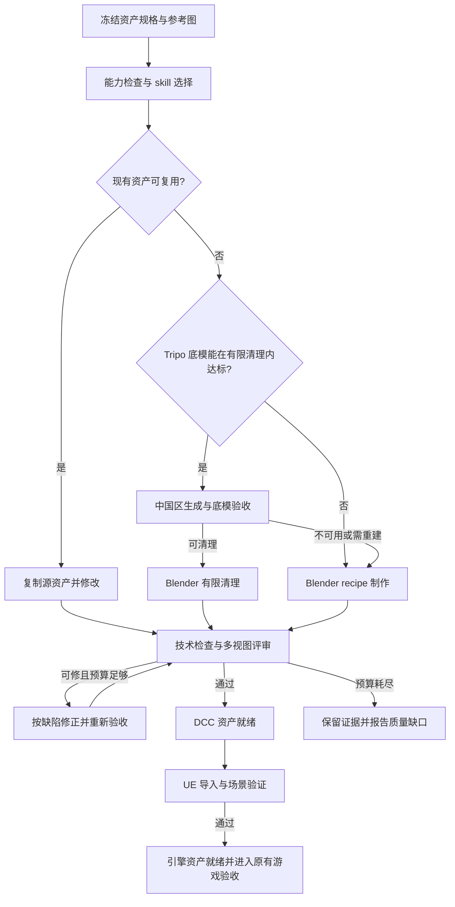

# Blender 建模 harness 与 skill 落地方案

日期：2026-09-22。执行环境：Windows worker，Blender 5.2.1 LTS，目标引擎 UE 5.8。
状态：**P0–P3 已实现并进入本机实测；P4 基准工具已实现，正在执行首次样本校准。V2 默认关闭，显式合同可用于隔离任务。**

本方案接续 [建模分流设计](worker-modeling-routing-design.md)。建模能力增强以当前未提交工作树为基线，
不是以线上 worker 已具备这些能力为前提。代码实施限定在 `worker/`、`skills/`，文档放在
`knowledgebase/`。实施记录见 [实施与校准报告](worker-modeling-harness-implementation.md)。外部资源已按固定 commit 适配为四个本地 skill，Tripo 中国区已完成一次真实生成。

## 1. 决策与目标

保留宿主掌握的资产规格、复用优先、Tripo 预算、防重复付费、取消、证据与哈希验收。
在这个框架中增加按资产类型选择的建模知识、可复现 recipe、过程预览、技术检查和 UE 导入验收。

外部 skill 作为经过版本固定和适配的专业知识及脚本来源；路由、重试和最终接受仍由宿主决定。
首期继续使用现有无界面 MCP，通过显式保存和重开 `.blend` 维持状态。工具数量和 skill 数量不作为质量指标。
有机角色、精密重建等任务必须通过各自基准，不能由简单道具通过率推定能力。

整体流程：

## 2. P0：Tripo 中国区接入

用户确认本机无法访问国际站，且新 Key 属于中国区。因此默认 API 固定为
`https://openapi.tripo3d.com/v3`，不跨区域自动重试，也不将 API 端点替换规则套用到 CDN 下载地址。
Key 继续由宿主从 `TRIPO_API_KEY_FILE` 或仓库根目录的本地 `tripo.txt` 读取。
接口依据：[Tripo 中国区鉴权文档](https://developers.tripo3d.com/en/docs/authentication)。

设计时的只读检查和实施后的验证结果：

| 验证 | 结果 |
| --- | --- |
| 新 Key 直接查询中国区余额 | 2026-09-22 15:48:14 UTC，HTTP 200、`code=0`、余额 3000、冻结 0 |
| 修改后默认 Provider 真实查询 | 15:49:45 UTC，实际请求 `.com/v3/account/balance`，HTTP 200，`status=ready`、余额 3000 |
| Provider JavaScript 语法检查 | 通过 |
| `node --test worker/tests/modeling.test.mjs` | 33 项通过、0 失败 |
| 付费生成、远端任务轮询、真实 CDN 下载 | 实施阶段已通过一次中国区真实生成并下载 GLB，消耗 20 credits，余额 2980；详见实施报告 |

已修改 `worker/agent/providers/tripo.mjs` 的默认地址，并更新部署及路由说明。
新进程加载此代码后使用中国区；运行中的旧进程不会因源码修改自动刷新。设计阶段未重启服务；实施部署结果由 `runtime/deployment.json` 记录。
历史网络错误与旧 Key 的 401 记录保留为历史，不再用于判断新 Key。

## 3. 当前实现需要补齐的环节

| 当前事实 | 实施方向 |
| --- | --- |
| MCP 只有 `blender_health`、`blender_run_python`；通用 bpy 可执行复杂操作 | 补充受控的场景查询、预览和检查点接口，减少临时脚本重复实现；不以“工具少”推定 bpy 能力不足 |
| 每次 MCP 调用创建新 Blender 进程；响应只有文本 | 显式源文件/输出文件合同，结构化查询，以及能真正送到模型的图片证据 |
| 当前 author prompt 仅要求“若可用则读 create-game-assets” | 宿主提供确定的 skill 文件路径、版本和按任务生成的加载计划 |
| 几何检查后才统一渲染四视图、做独立评审 | 在轮廓和结构完成时提前看图，再进行材质、LOD 和导出，降低整件返工 |
| UV 主要检查是否存在；rig 仅粗查骨架和顶点组；尺寸只报告 | 增加类型适用的可测门槛，真实绑定/变形检查，明确要求值、容差与测量值 |
| 当前规格只有文字要求、面数、参考图和 rig/闭合开关 | 增加单位、pivot、纹理、碰撞、LOD、导出与参考图视角等明确合同 |
| `advancedModeling` 为 unverified，健康检查只运行 `--version` | 分开记录启动可用性、脚本/导入导出能力和真实资产基准成绩 |
| 统一交付 `.blend + GLB`，后续由生产 agent 集成 UE | 将 DCC 就绪与 UE 就绪分成两个结果，最终验收必须检查目标引擎证据 |

现有单元测试和四路线 probe 已证明调度、基础 bpy、导出、渲染、回退和取消可以工作。
上一轮 probe 的 author/evaluator/visual reviewer 使用 fixture，不能当作专业建模质量基准。

## 4. skill 选型、固定版本与适配

设计阶段只审阅上游文件和许可证。实施阶段已按下列固定 commit 引入所选文件及引用依赖，
保存许可证、原始 hash 和本地改动记录；未经选取的外部工作流未引入。

| 来源与调查 commit | 选择内容 | 本地用途与适配 |
| --- | --- | --- |
| [RobLe3/cc-blender-skill](https://github.com/RobLe3/cc-blender-skill/tree/11016c9a5847897491dde935c346571bd7548e3d)，MIT | `blender-modeling`、`blender-uv-texturing`、`reference-analysis-validator`、`closed-surface-uv-coverage`；借鉴 refinement 思路 | 建模顺序、UV、参考图度量与缺陷分类。替换外部 MCP 名称；去除其运行时改写 skill、准备发布等流程，修复循环交给宿主 |
| [arjun988/blender-skills](https://github.com/arjun988/blender-skills/tree/8f778d2405a214b508d4c7d80742be8e43acdd52)，MIT | `hard-surface`、`uv-workflow`、`lod-pipeline`、`collision-proxy`、`unreal-export`、`qa-review` | 按需读取具体专业模块。导出参数经本机 Blender/UE 导入测试后固定，不能直接照抄通用坐标轴示例 |
| [ozanzeng/blender-LPM-skill](https://github.com/ozanzeng/blender-LPM-skill/tree/687d0a46f1280bc7d11dbf83539840100ec909dc)，MIT | `lpm.py`、场景检查、视图及轮廓比较脚本与 recipe 思路 | 仅用于指定的低模风格；适配 GLB/UE 输出、碰撞命名和材质通道。上游 Unity MaskMap 不直接作为 UE 材质；不启用附带的外部图像生成调用 |
| [MushroomFleet/BlenderRetopology-Skill](https://github.com/MushroomFleet/BlenderRetopology-Skill/tree/296bd4ac040d5164a5e3ccae0b5f1172e2bc25d7) | 重拓扑知识，后续角色阶段再评估 | 暂不纳入首批依赖。README 的 MIT 说法与根 LICENSE 的 Apache-2.0 不一致，且此前 README 提供的 skill 原始路径返回 404，先核实实际打包布局与许可 |

已建立四个窄范围本地入口：

| 本地入口 | 触发条件 | 产物责任 |
| --- | --- | --- |
| `yahaha-blender-modeling` | 通用道具、模块化/硬表面、已有资产修改 | 结构拆解、尺寸、可复现 recipe、分阶段源文件 |
| `yahaha-blender-reference-fit` | 有明确参考图或用户要求精确匹配 | 视角登记、关键部件/地标、相同视角的轮廓对比与修正 |
| `yahaha-blender-lowpoly` | 明确低模/平面着色风格 | 面数分配、单调色板材质、低模 recipe 与预算检查 |
| `yahaha-blender-unreal-handoff` | 目标引擎为 UE | LOD/碰撞/pivot/socket/材质与导出配置的交付合同 |

`create-game-assets` 继续负责整体美术和资产标准；`yahahagame-production` 继续负责生产阶段。
宿主针对资产选择最小模块集，先冻结规格，再加载专业模块。共享 QA 规则属于检查器，
不由多个 skill 分别给出互相冲突的“最终 PASS”。首批不整体导入完整外部 skill 集或替换 MCP 服务。

上游普遍假定 `execute_blender_code`、`get_scene_info`、`get_viewport_screenshot` 等工具，
且有些依赖持续打开的 Blender 场景。本地适配必须同时解决**工具名称与场景生命周期**，只改工具名不够。

## 5. P1：规格、专业路由与过程反馈

### 5.1 规格与兼容

新增内部 v2 规格，保留原始 `requirements` 的逐条覆盖和 revision 不可削弱规则：

| 字段组 | 内容 |
| --- | --- |
| 类型 | `assetClass`：static-prop、modular-kit、organic-static、skeletal-character；`styleProfile` |
| 单位/变换 | 米制尺寸、逐轴容差、forward/up、pivot 语义和允许偏差；精确值未知时显式记 unknown |
| 预算 | 分 LOD 的三角形上限、材质槽数、纹理尺寸与总内存预算 |
| 参考 | 每张图的角色、视角、相机是否可匹配、遮罩/地标、哪些部分不可观测 |
| 运行时 | 碰撞类型、必要 socket、LOD/Nanite 策略、骨架/动作、目标引擎和导入 profile |
| 溯源 | `recipeHash`、`skillLockHash`、参考图 hash、源资产 hash、contract version |

先增加 worker 内部的 normalize 层：旧规格保持旧规则，新字段未知时不能自动标记通过。
含新验收项的任务必须使用 v2。升级 validator、参考图或 skill 后创建新 revision，
不能用旧 acceptance hash 为新的标准背书。无需首批修改 controller 协议。

`skill-plan.json` 由宿主生成，记录选中模块、固定版本、读取顺序、输出要求和适用检查。
author 使用仓库固定版本的明确路径；不依赖用户全局 skill 是否存在，也不运行期间在线升级。
可执行 helper 复制到任务的受控工具目录后运行，并记录 hash；运行产生的输出仅在任务目录内。

### 5.2 无界面 MCP 的最小扩展

保留两个现有工具，拟新增以下三项，均复用现有进程执行、超时、取消和 receipt：

| 工具 | 输入 | 输出与约束 |
| --- | --- | --- |
| `blender_inspect` | 工作区相对 `.blend` 路径、对象/collection 选择器 | 对象、变换、拓扑计数、材质/UV、rig 绑定等有界 JSON；显式打开源文件 |
| `blender_render_views` | 源文件、视图 profile、输出目录 | 图片文件、相机参数、源 hash；返回有大小上限的 MCP image 内容或由宿主将图传入下一 author/reviewer 调用 |
| `blender_checkpoint` | 当前已保存源文件、阶段、预期 hash | 创建不可变副本和 checkpoint manifest；由宿主写入/校验，恢复到新的 attempt 路径 |

每张图必须绑定被渲染源文件的 hash 和视角。仅打印 PNG 路径不算已向模型提供视觉反馈。
`blender_run_python` 保留通用 bpy 能力，但仍不是 OS 安全沙箱；路径检查和禁用 autoexec 不能被描述为任意 Python 的隔离。
暂不增加持久 Blender daemon；先记录启动耗时占比，确认收益后再设计共享进程的状态和取消问题。

### 5.3 单资产制作流程

按 `blockout -> geometry -> materials -> runtime-prep -> final-check` 执行。
简单静态道具可合并中间阶段，但轮廓预览和最终检查必需。每阶段保存 recipe/参数、源文件、
预览和短报告；阶段失败从最近通过的 checkpoint 复制并修复，不写回已接受资产。

宿主把缺陷分成 silhouette、dimension、topology、UV、material、rig、export，
再按缺陷选择修复模块。禁止通过隐藏对象、改相机、降低材质亮度或放宽门槛来掩盖失败。
如重拓扑修改 UV，必须重新检查 UV、材质和最终导出。

现有 direct 最多 3 次、reuse/cleanup 最多 2 次 author 尝试作为总上限。
阶段拆分不为每个阶段再重置预算；新增阶段反馈计入同一 wall-clock/调用预算。
所有操作继承任务取消和 deadline。第三方完整重拓扑、新 rig、主体重建仍超出有限清理路径；
需要这些工作时重新路由，并保留原目标与第三方来源记录。

## 6. P2：技术与视觉验收

检查结果统一为 `PASS / GAP / NOT_APPLICABLE`，每项含 requirement ID、要求值、实测值、容差、
证据路径、检查器版本。N/A 必须由规格的适用规则产生，不能由作者任意声明。

| 门槛 | 实施与限制 |
| --- | --- |
| 网格/单位/pivot | 源文件及实际导出重导入后的世界坐标尺寸、非有限值、退化面、法线与负缩放；闭合检查仅在规格要求时开启 |
| 对象角色 | manifest 显式区分 render-mesh、LOD、collision、helper；面数预算和预览只统计对应集合，避免 UCX/辅助网格误入美术验收 |
| UV | 按实际使用贴图的材质/网格检查 UV、有限值、覆盖与退化；lightmap 另行要求 padding/非重叠，不全局禁止镜像或平铺 UV |
| 材质/纹理 | 实际非空材质绑定、贴图可读取、尺寸/内存预算、色彩空间和通道映射；程序材质应验证导出后的表现 |
| LOD/碰撞 | 仅对要求的资产检查数量、预算、pivot 一致性、凸性/封闭性及命名；是否被 UE 识别在 P3 判定 |
| 骨骼 | 匹配的 Armature modifier、骨骼权重关联、未绑定点与权重归一化；要求动作的角色增加代表姿势和动画预览，空骨架加任意顶点组不能通过 |
| 视觉 | 固定光照下 front/side/back/top/perspective；非对称资产追加另一侧，必要时增加底视、wireframe 和材质检查图 |
| 参考匹配 | 相机/视角可比时才使用轮廓 IoU、关键点及尺寸偏差；先登记阈值再生成，轮廓与轮廓比较；单张透视图不承诺不可见面精确还原 |

独立视觉 reviewer 继续逐条覆盖原始要求，并真正接收图片。确定性检查先失败时先修对应问题，
减少无效视觉调用。技术通过且视觉通过才能达到 `DCC_READY`；缺评审证据保持 GAP。
轮廓指标作为局部证据，不单独代替材质、细节或整体美术判断。

建议先覆盖静态道具与模块化套件；骨骼、复杂自交和变形等高级检查逐项标记能力，
未实现的必需检查不得写 PASS。精密尺寸用数字测量，不让视觉 reviewer 估尺寸。

## 7. P3：Unreal 交付合同

保留 `.blend` 为编辑源，GLB 为通用预览/交换文件；**不要求所有 UE 资产一律改用 FBX**。
按本机已验证的 importer profile 选择格式：简单静态资产可验证 GLB/Interchange；
依赖自定义碰撞、socket、LOD 或骨架的资产应测试对应 FBX/Interchange 路径并锁定参数。
依据：[Epic FBX Static Mesh Pipeline](https://dev.epicgames.com/documentation/en-us/unreal-engine/fbx-static-mesh-pipeline-in-unreal-engine)、
[Interchange 导入](https://dev.epicgames.com/documentation/en-us/unreal-engine/importing-assets-using-interchange-in-unreal-engine)。

使用独立的资产测试地图，首先验证 1 米标尺、非对称方向模型、铰链门、带 UCX 的凹形道具及两个 LOD。
记录实际 `.uasset`、包路径、单位、bounding box、pivot/socket、LOD、碰撞体和材质通道。
PBR 通道由项目固定配置映射；FBX 导入成功不表示所有贴图自动接线正确。

宿主接受模型后先保留 `DCC_READY`。现有生产 agent 创建/打开 UE 项目并导入，随后由宿主检查
UE 产物与截图，才标记 `ENGINE_READY`。这样兼容目前建模 prepare 早于项目 bootstrap 的调用顺序。
引擎导入设置问题由集成阶段修复；涉及模型源文件的变化通过 revision 请求返回建模宿主。
保持原来的整体打包和运行验收，不用 `ENGINE_READY` 替代完整游戏 PASS。

## 8. 状态、证据和 Tripo 后续补齐

沿用 `art/models/<assetId>/<revision>/<attempt>/` 及对应 `stages/.../models/` 证据目录。
新增 recipe、skill-plan、checkpoint、技术报告、reference-match、UE 导入报告的 manifest 条目，
而不是扫描目录猜测哪个文件有效。宿主记录依赖 hash 并将接受决定写到 agent 工作区之外；
对外展示的镜像报告不作为可信状态来源。

缓存键需包含规格、源资产、参考图、skill lock、validator、Blender 与导出 profile。
更换任一关键输入就触发相应下游重验。旧任务保持原 contract；不原地改写历史证据。

Tripo 后续与 P1 一起补齐：

- 区分“Key 文件可读”“在线鉴权/余额通过”“任务生成成功”。当前 `availability()` 只检查文件，
  新设计在选择第三方前进行有界只读 preflight，并对同一 run 缓存结果。
- 将 `providerRegion=cn`、API 版本和模型版本写入新 provider state；已有无区域状态不猜测迁移，
  不能把国际区旧 task ID 自动拿到中国区轮询，更不能因迁移重复提交。
- 新 Key 只影响新资格检查；已记为 unavailable 的旧 revision 仍保留历史。需要重新生成时新建 revision，
  保持预算，不清理 ledger 来强行重试。
- 单次生成额度和真实 CDN 地址要通过有界生成样本验证；下载按服务端给出的 HTTPS 地址处理，
  不转发 Key，不为匹配域名字符串而自动重写下载地址。未知 CDN 先记录 host 并检查归属，再更新允许列表。
- API 不可用和生成不达标继续回退；晚到的远端结果不覆盖已通过的 Blender 结果。

## 9. 文件拆分与实施顺序

以下为实施批次；对应代码和探针已创建，验收结果以实施与校准报告为准。

| 批次 | 文件与工作 | 退出条件 |
| --- | --- | --- |
| P0，已完成 | `worker/agent/providers/tripo.mjs`、部署/路由说明 | 中国区余额通过；33 项现有回归通过 |
| P1a | `worker/agent/modeling-evaluation.mjs` 增 v2 规格与 normalize；新增 `modeling-skill-routing.mjs`；`skills/yahaha-blender-*/` 和版本清单 | 旧规格兼容；按任务读取正确 skill；版本/引用闭包可复现；硬表面与低模各一件真实制作 |
| P1b | `worker/tools/blender-mcp-server.mjs`、`modeling-capabilities.mjs`；新增 `modeling-scene-query.py`、`modeling-render-views.py`；`modeling-pipeline.mjs` 接入 checkpoint/阶段反馈 | 模型实际看到中间预览；保存/恢复、中文路径、取消、预算共享通过 |
| P2 | 扩展 `modeling-asset-check.py`；共享 view profile；新增 `modeling-reference-check.py`；完善缺陷修复调度 | 注入尺寸错误、缺材质、坏 UV、无效 rig 等样本均被对应检查拒绝；好样本不过度误拒 |
| P3 | 新增 `modeling-unreal-check.py`；更新 `production-harness.mjs` 的导入后检查和 `yahaha-blender-unreal-handoff` | 真实 UE 资产在测试地图中通过尺度、材质、碰撞、LOD/动作等适用项 |
| P4 | 扩展 `modeling-pipeline-probe.mjs`；新增真实资产 benchmark 清单与报告；部署文档 | 达到下述校准标准，并在空闲 worker 通过 Git 部署流程上线 |

P1a 与 P1b 必须共同通过才启用过程反馈；P2 为质量门槛；P3 依赖 P2 和 UE 项目就绪。
复杂角色/手工重拓扑扩展放在静态资产稳定后，避免首批同时引入多套骨骼约定。

## 10. P4：基准、发布与回退

首批固定 6 类任务：精确尺寸硬表面道具、已有资产改色/局部修改、带碰撞模块化门框、
带参考图低模武器、有机静态道具、含绑定/姿势要求的简单角色。静态资产先启用；角色未通过前继续标记未校准。
每类建议至少 3 次独立运行，记录原始要求、输入 hash、模型/skill/工具版本、预算及实际证据。

比较当前基线与增强方案的逐项通过率、盲看图评价、总耗时、修复次数、模型调用量、
生成额度、fallback 时间和人工返工。使用相同规格、模型配置和预算；第三方结果随机性单独记录。
新增技能的收益需要运行证据，不采用上游宣传的“AAA”或样例数量作为本地成功率。

发布条件：

1. 所有必需技术门槛和控制测试通过；所有必需视觉项有实际图片评审。
2. 适用资产在 UE 测试地图内通过；没有把 DCC PASS 当作引擎 PASS。
3. 无重复付费、无预算重置、无跨任务源文件覆盖；取消后确认子进程停止。
4. 同预算的对照样本质量不退化，新增流程的收益和耗时有记录；失败类型保留并限定能力范围。

已新增单一发布开关 `MODELING_HARNESS_V2_ENABLED=0`，先用于隔离任务和空闲 worker。
启用后按 task 固定 contract/skill lock，活动任务不热切版本。回退只影响新任务；
当前任务保持原版本或停止并保留证据，不通过降低门槛回退。
部署沿用仓库 Git 部署脚本，固定 commit，先确认无活动 allocation，再启动并做部署后的 smoke。

实施后的全局开关仍为 `0`。未完成足够重复样本、同预算对照和高级 importer 校准前，不将新流程宣称为普遍稳定。显式 v2 合同可以使用已实现的流程；未支持的必需检查返回 GAP。
