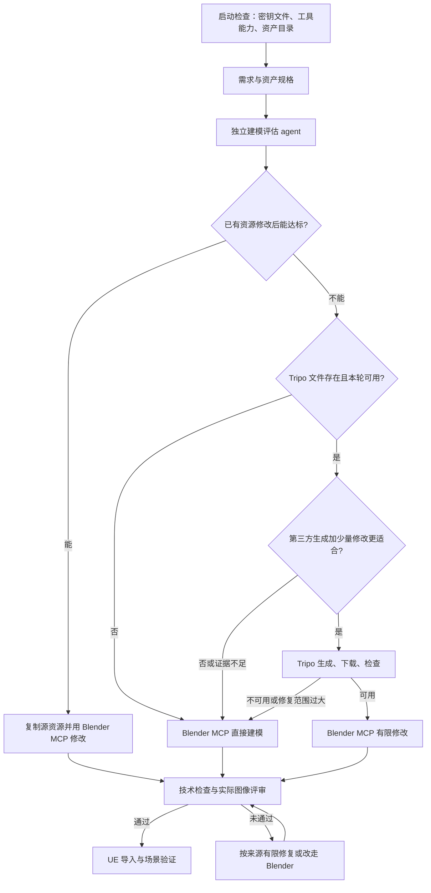

# Worker 建模评估与执行分流设计

日期：2026-09-22。状态：第一阶段已实现，通过下述 Windows 验证，尚未部署。
研究基线：`fbd699048b2524fdf93b2f28fa5fbe8c3f3f087e`。

实现入口为 [modeling-pipeline.mjs](../worker/agent/modeling-pipeline.mjs)，配置与操作说明见
[Worker 部署文档](../worker/DEPLOYMENT.md#modeling-assessment-and-routes)。已包含独立评估、
已有资源修改、直接 Blender MCP 制作、Tripo 适配与自动回退、统一几何及图片评审、状态恢复和本地密钥保护。
2026-09-22 后续已用更换后的中国区 Key 通过余额鉴权，默认端点改为 `openapi.tripo3d.com/v3`；
技能增强、MCP 过程反馈和 UE 验收的分批方案见 [harness 升级方案](worker-modeling-harness-upgrade-plan.md)。
下面的现状分析和基线测试记录保留设计时语境；实现验证记录见文末。

建议在每项建模工作前增加独立评估 agent，由 worker harness 校验并执行其决策：先判断已有资源能否经 Blender 修改达到目标；不满足时，再选择 Blender 直接建模或 Tripo 生成后由 Blender 做有限修改。文件缺失或第三方不可用都收敛到 Blender，最终品质要求保持不变。

## 1. 当前流程与缺口

本机 `CODEX_MACHINE_ROLE` 未设置，但主机 `YahahaSandbox0` 上存在 worker agent、`D:\game\worker\tools\worker-monitor.mjs` 进程和 `runtime/config/worker.env.ps1`，据此识别为 **worker**。实现限定在 `worker/`、`skills/`，设计阶段为测试密钥添加了本地 Git 排除规则。

| 位置 | 当前行为 | 对本次设计的影响 |
| --- | --- | --- |
| [agent.mjs](../worker/agent/agent.mjs)，`executeJob`、`step` | 创建持久 project 和按 run 分开的输出目录；执行命令、记录日志、上传报告 | 可复用执行、取消、进度、上传设施；不能把凭据放进命令、prompt 或日志 |
| [production-harness.mjs](../worker/agent/production-harness.mjs)，`runProductionHarness` | 一次生产 Codex 调用执行规划、资产制作、玩法、打包等全部十个阶段 | 目前没有可由宿主接管的建模分支边界；只修改 prompt 不能保证回退与预算 |
| 同文件，`inspectProduction`、阶段验证 | 检查固定十阶段、报告、UE 加载、打包程序启动和验收状态 | 第一阶段保留十阶段合同，在资产阶段内部添加子流程 |
| 同文件，`collectQualityEvidence` | 主要读取 JSON；图片只作为路径和大小传入，且存在文件数、文本量限制 | 不能据此认为评审 agent 已看到模型外观；需显式传入受控图片证据 |
| [quality-review.mjs](../worker/agent/quality-review.mjs) | 整体硬检查通过后，只有显式质量标准才触发独立质量评审 | 新的建模评估与模型验收不能依赖这个开关 |
| [iteration-monitor.mjs](../worker/agent/iteration-monitor.mjs) | 已有受限独立 agent、结构化响应与有界修复；命令超时等可能立即 stop | 复用 agent 调用方式，但第三方不可用必须先在建模子流程内转为 fallback |
| [local-worker-probe.mjs](../worker/tools/local-worker-probe.mjs) | 调用 Blender CLI 和 Python 做启动/渲染检查 | 只能证明 CLI 路径，不能证明 Blender MCP 能力 |
| [生产技能](../skills/yahahagame-production/SKILL.md) | 已要求艺术方向、资产来源、证据与阶段报告 | 增加逐资产评估、分支执行、统一验收的引用与约束 |

实际工作区已有多版 `.blend`、FBX 和 `tools/author-*.py`、`animate-*.py` 等 `bpy` 脚本，说明已有可复用资产与脚本制作路径。当前 provenance 清单混有代码、打包产物等，不能直接当作可编辑模型目录。

仓库代码和本次检查的用户 Codex 配置未发现明确的 Blender MCP 配置或适配层；这不是对所有安装位置的完整盘点。配置中的模型为 `gpt-6-astra`、推理强度 `xhigh`，但 harness 未固定模型，进程实际加载的配置仍须在运行时记录。现阶段没有足够证据宣称“当前模型 + MCP 可以稳定完成高精度角色”。历史设计文档中的“只做工具启动检查”也已落后于当前代码，应以以上实现为准。

## 2. 目标流程

每个独立资产或共享拓扑的资产族独立路由，避免把整个游戏统一判成一种建模方式。



顺序是硬规则：没有 `tripo.txt` 只跳过第三方比较，仍然先评估已有资产是否可修改达标。Tripo 路由被否决或失败后，同一资产 revision 内不再跳回 Tripo，防止循环付费。

“回退”保证继续尝试本地制作，不保证未经验证就 PASS。Blender 确实无法满足强制品质要求时，记录具体缺口，按现有有界修复与验收机制结束；不得将原型品质冒充最终品质。用户取消、租约失效或进程停止未确认时，停止执行，不以第三方回退为理由继续工作。

## 3. 建模评估 agent

### 输入与职责

由 harness 启动一次受限、结构化输出的独立 agent，不让生产 agent 自行决定是否调用。建模入口的首个决策 agent 即为该评估器；完整游戏任务可以先执行前三阶段的需求、项目初始化和艺术规划，但该阶段不制作最终模型，得到清单后立即评估。

输入由宿主收集，包含：

- 需求：用途、参考图、目标轮廓、必需部件、尺寸及公差、视距与屏幕占比、风格、材质、动画/骨骼需求、运行平台。
- 品质：必须满足的逐项标准、面数/贴图/材质槽预算、变形和碰撞要求；缺失项记录假设，不能自行加“写实 AAA”目标。
- 能力快照：实际 agent 模型配置、Blender/插件/MCP 版本、可调用工具列表、探测结果，以及相同工具版本上的历史资产验收结果。
- 候选资源：来源、授权范围、文件哈希、可编辑格式、拓扑/骨骼/贴图信息、尺寸、同视角预览、已知缺陷。
- 第三方状态：仅 `enabled/disabled/degraded`、可用模式、预算与原因码；不包含 key。

评估 agent 只建议路径、解释证据和输出修改计划，不执行下载、支付请求、Blender 写入或外部检索。候选检索和能力探测由宿主适配器完成。可复用现有 reviewer 的受限调用，但独立设置超时和模型推理预算；不直接套用其所有低推理配置。

视觉判断需要真正传入参考图和候选图像内容，不能仅传文件名。优先使用经本机 CLI 验证的图像输入方式；不为此给 reviewer 开放任意 shell。图像不可用时标记视觉证据不足，禁止把相似性或品质写成已验证。

### 评估方法

采用“硬条件淘汰 + 分维度预测 + 成本比较”，不以一个总分覆盖关键缺陷。

| 维度 | 评估内容 | 主要证据 |
| --- | --- | --- |
| 复杂度 | 轮廓复杂性、重复结构、细部密度、有机形态、部件数量、变形要求 | 需求拆解、参考图与几何统计 |
| 精度 | 尺寸公差、对称、装配、身份/比例一致性、UV 与骨骼约束 | 明确规格与导入检查 |
| 品质 | 轮廓、结构、材质、风格、近景细节、动画和实际游戏视角表现 | 同视角图像、实际模型报告 |
| 当前能力覆盖 | 所需操作是否存在、相似任务是否成功、预计修复次数 | MCP 探测、工具版本、历史验证 |
| 复用相似度 | 语义、轮廓、比例、部件结构、风格、材质、骨架 | 检索排序后再逐候选比较 |
| 代价 | 制作/清理时间、预计请求次数、credits 上限、失败概率与剩余 deadline | 测试记录和当前预算 |

硬条件包括资源使用权限、文件可读可编辑、必要部件与骨骼可达、精度和预算可满足。缺少模型来源、只剩预览图、或关键操作未经验证，不能通过复用硬门槛。

每条候选路径输出 `predictedQualityByCriterion`、`capabilityCoverage`、`unknowns`、`confidence`、`estimatedWork`。品质采用项目定义的标准与证据；置信度只是分流参考，不等同于真实通过概率。上线前不宣称某个相似度阈值能普适保证结果。

1. **复用优先**：候选经有限修改可覆盖全部强制标准时，直接选 `reuse_blender`。必须明确源资产、保留部分、修改操作、预期差距和检查方式。不能只因名称相似就复用，也不能因“想尝试 AI”跳过可用资源。
2. **直接制作**：优先用于参数化结构、建筑模块、精确装配、简单风格化道具，以及已有可验证制作脚本覆盖的需求，选择 `blender_direct`。
3. **生成后清理**：只有第三方已启用、当前需求适合生成、预计基础形体更接近目标，且 Blender 能完成有限清理时，选择 `tripo_then_blender`。复杂有机静态装饰是测试候选；高精度机械或需严格骨架变形的角色不能仅按“复杂”自动送 Tripo。
4. **不确定时**：先做一次有界证据补齐/重新评估；仍不确定或评估器失效则走保守的 Blender 路径，保留风险与品质门槛。不能用无效 JSON 触发第三方生成。

“少量修改”须可执行：例如朝向、尺寸、原点、材质映射、局部拓扑修补、限定减面、碰撞和 LOD。首轮可试用不超过 2 次清理、清理时间不超过直接制作估算的 25% 作为预算，属于待校准策略。重做主体轮廓、全身重拓扑、重新设计角色绑定属于超范围，应放弃生成结果并进入本地制作。

### 资产检索与能力校准

首版检索当前 workspace 已验证资源和明确配置的授权资产库。其他 workspace 的文件不会因为磁盘可见就自动获得复用授权。资源必须复制进当前任务目录后修改，保留源文件哈希与来源；共享库保持只读。

建立轻量 JSON 目录即可开始：`assetId`、标签、尺寸、部件、风格、格式、骨骼、材质、授权、预览、哈希、历史品质。先按类型/部件/尺寸等召回最多 10 个候选，再让评估器比较前 3 个的实际图像和编辑成本。无候选正常进入新建流程，检索服务故障也不能阻断任务。向量检索作为后续优化，不作为本阶段依赖。

能力探测至少区分 `blenderCliAvailable` 和 `blenderMcpAvailable`。检查 MCP 连通性、工具列表、场景读取、脚本/操作调用、导入、保存、导出与渲染；写入探测使用独立临时场景，禁止修改活动场景。历史能力记录绑定模型、Blender、MCP 和脚本版本。缺少基准时输出 `unverified`，不能假定支持雕刻、重拓扑或复杂绑定。

用户要求的目标执行通道是 Blender MCP，因此实现首项包含 MCP 接入与验证。已有 CLI/bpy 路径可作为单独声明和验证的兼容后端，报告 `transport=cli`，不能把它伪报成 MCP 已通过。若两个通道都不可用，属于本地工具问题，应报告具体缺失。

## 4. Harness 接入方式

采用有限的分段调用，保留现有 controller 协议和十个顶层阶段：

1. **规划边界**：生产调用只完成需求、初始化和艺术计划，提交 `modeling-specs.json` 后退出。对已有任务读取原清单，复用未变化的资产。
2. **评估边界**：宿主收集候选与能力，启动建模评估 agent，校验响应并持久化逐资产决策。没有模型需求则记录 `NOT_APPLICABLE`，不额外生成模型。
3. **资产边界**：宿主逐项执行所选分支。Tripo 由 worker 模块调用；Blender 修改/制作由有界资产 agent 调用 MCP 完成。宿主可在每次调用结束后检查、改路由和写 checkpoint。
4. **集成边界**：资产通过统一验收后交还原生产流程完成导入、玩法、打包、试玩与最终质量评审。

前三阶段仍使用原 stage ID；逐资产评估和制作是 `asset-production-and-import` 的内部子流程，不新增第十一个顶层阶段。实际接入时同时验证 `art-direction-and-asset-plan` 的清单交接。

后续生产若提出新资产或改变关键规格，写出结构化待办并退出该分段，由 harness 对受影响项重新评估再继续。不能只在第一轮评估，随后让质量修复 agent 任意新增模型。不相关的 gameplay 修复不重新评估模型。

宿主负责写入有效决策和状态，生产 agent 只消费快照。对输入、源模型和决策做哈希绑定，验收前核对；发现原始规格或决策被改写应要求重新评估。当前生产调用采用宽权限执行，文件和 prompt 规则并不等于操作系统隔离，不能宣称已经从权限上杜绝绕过。

建议实现文件如下，均落在 worker 允许的代码边界：

| 文件 | 职责 |
| --- | --- |
| `worker/agent/modeling-evaluation.mjs` | 规格/响应 schema、评估 prompt、解析与硬条件校验 |
| `worker/agent/modeling-pipeline.mjs` | 逐资产状态机、分支、预算、回退与恢复 |
| `worker/agent/asset-catalog.mjs` | 授权范围内候选检索、元数据、哈希与预览索引 |
| `worker/agent/modeling-capabilities.mjs` | 工具能力快照和版本化验证记录 |
| `worker/agent/providers/tripo.mjs` | 密钥加载、请求、轮询、下载和错误归一化 |
| `worker/tools/modeling-asset-check.py` | Blender 几何/材质检查、标准视角渲染 |
| `worker/tools/modeling-pipeline-probe.mjs` | 隔离工作区的分流及回退验证 |
| 现有 `production-harness.mjs` | 分段调用与模型验收入口 |
| 现有 `agent.mjs` | 启动能力上下文、建模步骤标签、证据上传；模型步骤纳入 Codex 日志处理 |
| `worker/deploy/start-phase1.ps1`、配置示例 | 显式传递密钥文件位置和提供方设置 |
| `skills/yahahagame-production/` | 增加建模路由参考，规范分段交接及新资产重新评估 |
| `worker/tests/` | 分流、provider、恢复与 Windows 测试 |

进度通过现有 `phase/tool/step` 发布“评估模型”“修改已有资源”“Tripo 生成”“回退 Blender”等，细节以 JSON artifact 上传。无需为内部状态新增 controller task 状态。现有 `onIterationReview` 假定整轮 iteration 语义，建议新增 worker 内部模型报告回调后复用上传函数，不直接伪装成整体 quality review。

## 5. 合同、状态与持久化

建议最小产物：

```text
project/plan/modeling-specs.json
project/plan/modeling/requirements-<revisionId>/<assetId>/decision.json
project/stages/asset-production-and-import/models/<assetId>/<attemptId>/
  evaluation.json
  source-manifest.json
  provider-result.json
  geometry-report.json
  visual-review.json
  evidence.json
  previews/
project/art/models/<assetId>/<revisionId>/source.blend
project/art/models/<assetId>/<revisionId>/exports/
runs/<runId>/modeling/<assetId>/<attemptId>/state.json
```

`modeling-specs.json` 是当前清单索引，revision 下的决策不可覆盖。例示的路径中 ID 必须经校验和编码，不能直接使用任意模型名构造目录。

决策合同至少包含：

| 字段 | 含义 |
| --- | --- |
| `protocol, taskId, workspaceId, runId, revisionId, assetId` | 明确归属与版本 |
| `requirementsHash, capabilityHash, candidateHashes, evaluatorConfigHash` | 输入变化时精确失效 |
| `complexity, precisionRequirements, qualityCriteria` | 需求拆解与不可降低的验收条件 |
| `candidates[]` | 每个候选的证据、修改方案、是否达标及否决原因 |
| `route` | `reuse_blender / blender_direct / tripo_then_blender` |
| `sourceAssetId, editPlan, acceptanceChecks` | 源资源、操作清单与检查方式 |
| `alternatives[]` | 路径质量预测、能力缺口、预估成本、置信度 |
| `providerEnabled, providerDisabledReason` | 非敏感的第三方状态 |
| `budget, fallbackRoute, rationale, unknowns` | 有界执行及决策依据 |

响应必须通过 schema 和语义验证：引用候选必须存在；无 key 禁止 Tripo；必需标准不能缺失；reuse 必须有明确可编辑源；不得输出 key、任意外部文件路径或自行扩张预算。校验失败最多修复一次响应，仍失败则记录保守 `blender_direct` 决策。

每个资产维护宿主状态：

```text
SPECIFIED -> ASSESSED -> REUSE_EDIT | BLENDER_BUILD | PROVIDER_SUBMIT
PROVIDER_SUBMIT -> PROVIDER_WAIT -> PROVIDER_DOWNLOAD -> BLENDER_CLEANUP
PROVIDER_* / BLENDER_CLEANUP 不可用 -> FALLBACK_RECORDED -> BLENDER_BUILD
REUSE_EDIT 不达标 -> NEW_BUILD_ASSESSMENT -> BLENDER_BUILD | PROVIDER_SUBMIT
制作完成 -> TECHNICAL_CHECK -> VISUAL_REVIEW -> IMPORT_CHECK -> ACCEPTED
检查失败 -> BOUNDED_REPAIR -> 重验；预算耗尽 -> QUALITY_GAP
任意运行态 -> CANCELED / STOP_UNCONFIRMED（受外层控制约束）
```

`REUSE_EDIT` 先有限修复；确定不能达标后只重新判断新建路径，不再重复选择同一失败源。Tripo 清理/质量失败最多清理 2 次后走 Blender；直接 Blender 最多 2 次修复后保留缺口。以上是首轮默认预算，均受总 deadline 更严格约束。

恢复复用已验证的本地文件、hash 和 provider task ID，不因整体迭代失败重复生成。同一规格修改或能力版本变化只失效受影响资产及依赖。跨 run 使用旧产物要重新核对哈希和验收，创建当前 run 的证据引用，不能照搬旧 run 的 PASS。

当前 worker 对 `RUNNING` journal 重启已有停机确认门槛；本方案不绕过它。断点恢复指通过现有门槛后读取建模状态，不承诺当前尚未实现的自动 pause/resume。

## 6. Tripo 接入与密钥

### 启动行为

本阶段 `./tripo.txt` 明确定义为 **worker Git 工作树根目录下的文件**，本机为 `D:\game\tripo.txt`，不能随任务 `--cd` 变成 project 下的相对路径。

启动脚本解析仓库根目录，将绝对文件位置交给 worker；直接启动 `agent.mjs` 时从模块位置解析同一根目录。可允许显式 `TRIPO_API_KEY_FILE` 指向仓库外受保护文件，但不从其他隐藏配置偷偷启用第三方。缺失、空文件或不可读均得到 `providerEnabled=false` 和原因码，worker 继续启动。

启动只检查/加载文件，不做付费生成。新任务开始时重新采样状态，可识别后来增加或删除的文件；同一任务持有能力快照，提交前再检查是否仍有可用凭据。缺文件时第三方需求比较、余额请求、上传和生成调用次数均为零。

文件内容按 UTF-8 处理 BOM 和首尾空白；格式异常禁用该提供方。key 仅由 provider 适配器使用，不写入 prompt、argv、子 agent 环境、异常文本、URL、progress、报告或归档。生产 agent 不需要 key；当前宽权限运行并不构成读取秘密文件的强隔离，若要求强隔离，需独立身份/受限 provider broker。

本次只确认文件存在且非空，没有输出其内容。已在 `.git/info/exclude` 添加精确 `/tripo.txt`，这只保护当前 checkout。将来的启动/部署检查应检测该文件是否被跟踪或暂存；日志、归档和上传仅使用显式产物清单。机器凭据长期应放在仓库外配置目录，密钥内容始终不提交。

### API 合同

截至研究日期，官方同时可检索到旧 v2 与当前 v3 文档。首版建议固定 v3 适配器，不混用两套 host、字段或状态值；测试 key 能否访问 v3 仍需实现时的真实探针确认。

| 操作 | v3 合同 |
| --- | --- |
| 基址与鉴权 | `https://openapi.tripo3d.ai/v3`，HTTP Bearer |
| 创建 | `POST /generation/text-to-model`；图生模型另用对应 image 接口 |
| 轮询 | `GET /tasks/{task_id}` |
| 余额预检 | `GET /account/balance`，按需在首个第三方分支检查 |
| 成功判断 | 同时检查 HTTP 状态、业务 `code`、任务终态和完整输出 |
| 输出 | 从任务 `data.output` 获取模型地址，再下载到本地并验证 |

依据：[官方简介](https://developers.tripo3d.ai/en/docs/introduction)、[任务查询](https://developers.tripo3d.ai/en/docs/task-query)、[余额接口](https://developers.tripo3d.ai/en/docs/account)。余额预检只能尽早发现问题，不能证明后续请求一定有 credits。

模型版本与参数须配置并记录。可用 `v3.1-20260211` 作为初始测试候选，明确设置材质、纹理、面数等参数；最终是否适合本机资产以测试为准。已有参考图时可评估图生模型，首版优先打通单资产文本路径。生成得到 GLB/其他支持格式后交给 Blender，再按现有 UE 导入路线导出，不把第三方 URL 当成交付物。[官方文本生成参数](https://developers.tripo3d.ai/en/docs/generation-text-to-model/standard)

provider 统一返回 `ready / unavailable / canceled` 结果，其中 `unavailable` 带 `reasonCode`、HTTP/业务码、task ID、可重试性与已耗预算。不能把原始 HTTP 异常直接抛到整轮 iteration monitor。取消和本地不可确认停止属于控制错误，继续向外传播。

### 超时、预算与重复付费

首轮建议：单 HTTP 请求 20 秒；轮询间隔从 3 秒增至 10 秒并加抖动；单资产第三方总耗时上限 8 分钟；每资产 revision 最多 1 次生成提交；单 worker 最多 1 个第三方生成任务。参数可配置，但不能超过任务剩余时间，需预留 Blender 制作与验收时间。没有足够回退时间时直接走 Blender。

credits 预算按固定模型/参数的费用资料或有界测试结果配置，不虚构单次价格。预算未知时不开放无上限批量生成。成功调用记录返回的消耗；超时且远端结果不明时记为 `unknown`，不能记为零。

请求前原子写入 `submission-intent` 和由输入/参数生成的 request hash，拿到 task ID 后立即落盘。轮询失败或重启后用同一个 ID 查询，不能重新 POST。

如果 POST 已发送但响应丢失，或落盘前崩溃，不能证明服务端未受理。没有经过确认的服务端幂等/对账能力时，标记 `submission_unknown`、保留预算占用并回退 Blender，不盲目重发。HTTP 5xx 同样可能出现受理不明。只有确定安全的 GET/下载重试；明确拒绝且未创建任务的提交也应由策略限制，首版可直接回退。

所有 HTTP、等待和下载都继承外层 AbortSignal。worker 停止轮询不代表远端任务取消成功；未验证服务端取消能力前，只记录远端状态可能继续运行。回退一旦提交，晚到的 Tripo 结果不得覆盖 Blender 新结果或已接受的资产。

## 7. 第三方失败与质量不达标的处理

官方文档列出了 HTTP 错误与业务错误，包括 credits 不足 `2010`、鉴权问题、限流与参数错误；应用应同时解析两层结果。[官方错误说明](https://developers.tripo3d.ai/en/docs/error-handling)

| 情况 | 当前资产动作 | 后续处理 |
| --- | --- | --- |
| key 文件不存在/空/不可读 | 跳过第三方判定，走复用或 Blender | 记录 disabled 原因，worker 正常运行 |
| credits 不足、key 无效或无权限 | 立即回退 Blender | 当前任务禁用 provider，避免逐资产重复尝试 |
| service down、DNS/TLS/连接问题、HTTP 5xx | 明确不可用即回退；已知 ID 的只读查询可短暂重试 | worker 冷却 5 分钟，之后只做只读健康/余额探测 |
| 429/业务限流 | 安全的只读请求按 Retry-After 有界重试；超预算回退 | 不无限等待、不重复未知提交 |
| 参数/模型版本不支持、输入被拒绝 | 记录脱敏原因后回退 Blender | 不让 agent 循环改 prompt 重新付费 |
| 任务 failed/cancelled 或超过等待预算 | 回退 Blender | 保留 provider task ID 和失败原因 |
| HTTP 200 但非零业务 code、未知状态、缺 task ID/模型 URL | 按合同不可用回退 | 不把格式异常当成功 |
| 下载失败、链接失效、空文件或错误格式 | 对同一 task 有界重新查询/下载，仍失败即回退 | 无新生成；文件哈希和真实格式检查 |
| 模型无法导入、纹理缺失、轮廓严重偏差 | 在小修预算内清理，否则回退 Blender | 失败产物隔离保留，不直接导入正式 UE 资源 |
| 全局取消、deadline/lease 失效、停止未确认 | 停止；不启动 Blender 回退 | 保持现有 worker 控制语义 |
| 磁盘不可写或本地工具不可用 | 报告本地基础设施错误 | 不能伪报第三方故障并无限回退 |

冷却和剩余预算应跨整体生产迭代保存，避免 quality repair 时重新尝试同一已失败 provider。连续健康任务之间的 provider 禁用可按原因区分：鉴权问题等凭据变更再复测，余额问题短期冷却后只读复测，服务故障到期复测。复测失败直接保留 Blender 路径。

下载到任务目录的 `.partial` 文件，完成后验证长度、格式、hash，再原子重命名。限制下载大小与重定向，要求 HTTPS；模型地址下载不附带 Tripo Authorization，避免向 CDN/重定向目标泄漏 key。带签名的完整 URL 不写入公开报告，恢复时优先重新查询 task。

## 8. 统一品质门槛

三条路径使用同一套验收，不允许第三方生成路径降低要求。

- 技术：文件可导入、比例和轴向正确、原点正确、法线和退化面检查、UV/材质贴图完整、面数和材质预算、必要的骨骼/权重/碰撞/LOD。
- 视觉：轮廓和关键部件符合需求，风格和材质一致；实际尺寸下的正面、侧面、背面、三分之四视角，并补充游戏相机视距截图。
- 动画资产：实际骨架绑定、关节变形和要求的动画片段验证；静态预览通过不能替代。
- 来源：输入资源、授权或生成来源、provider/model/参数、源文件与最终文件 hash、修改链条。
- 引擎：UE 导入后的比例、材质、朝向和实际场景表现，保留现有打包与最终验收。

条件需按资产类型适用：例如开放布片不能一律要求水密，静态道具不强求骨架。脚本测量提供可复现事实，独立图像评审提供视觉判断，最终由 harness 合并。缺少证据应为 GAP，不能依靠作者自报 PASS。

逐资产报告与 hash 必须由新增模型检查器明确读取；当前 `collectQualityEvidence` 的截断/排序机制不足以保证模型证据进入最终评审。整体质量 reviewer 可读取精简模型结果和关联图像，但不替代资产阶段的独立门槛。

## 9. 验证与落地顺序

分三批小改动实现，每批保留可独立审查的合同和测试：

1. **评估与复用/直接制作**：MCP 能力探测、资产规格/目录、独立评估 agent、分段 harness、统一模型验收。无 key 路径先闭环。
2. **Tripo 与回退**：固定 API 合同、密钥启动检查、单次生成、下载、有限清理、回退及费用/恢复状态。先用本地假服务覆盖故障，再用测试 key 做有界真实验证。
3. **校准与回归**：选择真实资产任务，比较原流程和新路由的通过率、质量差距、制作时间、人工返工、复用命中率、第三方净收益、credits 与回退时间。再决定扩展图生模型、共享目录或检索能力。

必要用例：

| 验证组 | 必须证明的行为 |
| --- | --- |
| 顺序 | 任何最终模型写入前都有有效评估；复用可达标时不会创建 Tripo 任务 |
| 无 key | 无第三方比较或网络调用；复用失败后直接进入 Blender |
| evaluator 异常 | 超时、非法 JSON、虚构候选、缺证据均不会触发未授权/无预算生成 |
| provider 故障 | credits、401/403、429、503、DNS、超时、业务错误全部到达预期回退且任务继续 |
| 结果不可用 | success 但无 URL、下载坏文件、导入失败、视觉不合格均不能直接 ACCEPTED |
| 幂等恢复 | 响应丢失、task ID 落盘前后崩溃、整体迭代重试不会重复 POST；旧结果不能覆盖新结果 |
| 控制 | 轮询/下载/清理/回退各阶段取消有效；停止未确认不得新启动写入 |
| 质量 | 复用、直接建模、Tripo 路径执行完全相同的适用验收项 |
| 兼容 | 固定十阶段、原有工作区、无模型需求、既有图像/游戏任务、原质量迭代保持可用 |
| Windows | 中文与空格路径、BOM key 文件、MCP 生命周期、Blender 进程树、原子写入与文件占用 |
| 凭据 | 不跟踪/暂存 key；测试 key 不出现在日志、progress、错误文本、产物、命令行或子 agent 输入 |

真实验证至少覆盖：简单精确道具、已有道具变体、有机静态道具、带骨骼角色需求，以及“Tripo 故障后 Blender 成功”完整链路。记录测量数据，不把“API 成功”算作建模品质达标。

本次已在 Windows 运行以下现有基线测试：

```powershell
node --test worker/tests/codex-execution.test.mjs worker/tests/iteration-monitor.test.mjs worker/tests/quality-review.test.mjs
```

设计阶段结果：38 项通过、0 失败、0 跳过。该批结果只记录实现前的 harness 基线；后续实现和验证记录见下一节。设计阶段未调用付费生成 API，未验证测试 key 的权限/余额，未实际执行 Blender MCP、模型视觉基准或 UE 新资产导入。未变更运行中的 worker、任务、journal 或已有资产。

## 9. 第一阶段实现与验证记录

后续实现已完成 worker 内的资产规格、评估 schema、目录与缺失预览生成、宿主路由状态机、
Blender stdio MCP、Tripo v3 适配、底模评审、有限清理、统一几何/图片验收、版本哈希与恢复预算。
生产 agent 通过受控修改请求返回建模边界；整体 Unreal、打包和运行验收继续使用既有流程。

2026-09-22 在本 Windows worker 的隔离临时工作区验证：

| 项目 | 结果 |
| --- | --- |
| `npm run test:worker` | 80 项通过，0 失败、0 跳过；其中建模新增 33 项 |
| Windows 部署测试 | 通过，包含默认本地忽略 key、已暂存 key 拦截、Git 更新、活动任务保护 |
| JavaScript、PowerShell、Blender Python 语法检查；技能校验 | 通过 |
| 无 key + 真实独立评估 | 选中直接 Blender；第三方评估标记为跳过 |
| Codex 实际调用 Blender MCP | 生成可编辑灯笼和 GLB；宿主验证 26,128 三角形，低于 30,000 限制；实际图片评审通过 |
| 已有资源复用 | 缺失预览由 Blender 补齐，真实评估选择复用，复制源文件后修改，原文件哈希保持一致，导出及图片检查通过 |
| credits 故障 | 注入 403/2010，转为直接 Blender，真实导出与图片验收通过 |
| 生成后清理 | 使用本地 GLB 模拟第三方成功响应，验证下载、导入、底模图片评审、MCP 小改和前后对比验收通过 |
| Windows 取消 | 真实 Blender 执行期间取消，确认其进程已经退出 |
| 真实 Tripo 连接 | 使用本地 key 仅查询余额，返回 `network_error`；无凭据的连接检查同样超时；未提交付费生成 |

测试输出均在临时工作区，未进入源码或提交。`tripo.txt` 保持未跟踪并由本地 Git exclude 排除，
源码变更只在 `worker/`、`skills/`，另外更新文档。未重启现有 worker、未改动活动任务或 journal。

仍需在第三方网络可用后验证真实生成、账号权限/credits 和实际 CDN 返回地址；当前无法据此声称
真实 Tripo 生成已验证。复杂有机模型、精密机械、骨骼变形与新资产 UE 集成的质量基准属于后续校准，
本阶段的静态道具样本不能证明这些能力。共享资产搜索和图生模型也未纳入本次实现。
