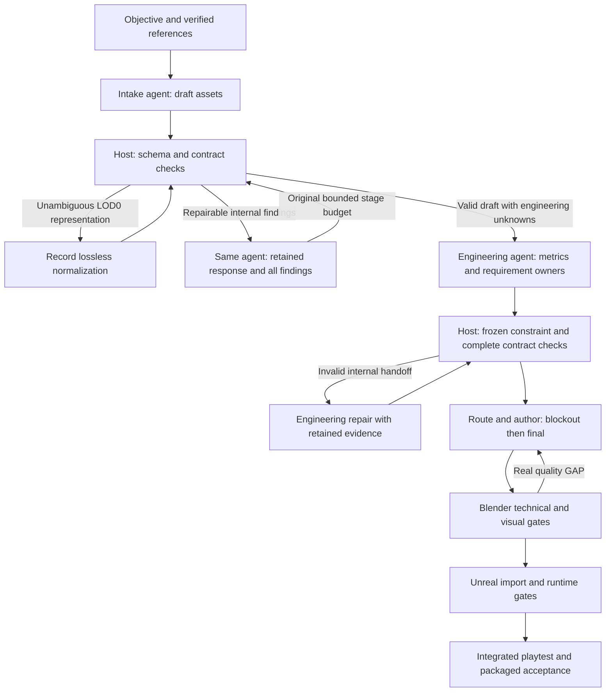

# V2 modeling internal recovery

## Reported failure

Task `task-91cb10ca-47df-4fce-afd2-4bc96c6f3985` failed before any model authoring.
Both intake calls completed in about three minutes, then failed semantic validation. This was
an internal protocol misunderstanding, unrelated to missing user requirements or the timeout.

The first draft used `maxTriangles=120000` and `lodTriangles=[120000,60000,30000]` for its modular
kit. The contract uses `maxTriangles` for LOD0 and the array for LOD1 onward, so the correct
representation is `[60000,30000]`. All six assets in both responses repeated this mistake.
The old repair prompt carried only “LOD budgets must decrease from LOD0”, without the preceding
response, asset identity, field, actual values, or LOD indexing convention. The second call
regenerated the asset list, changed IDs/budgets and repeated the error.

There was another defect: a missing traversal contract threw before the remaining checks, so
draft intake ignored that exception and also missed later LOD/profile defects on those assets.
The first draft's glider promised sockets/LODs under `glb-static`, an unsupported handoff.
The old passage detector also matched any use of “traversal”, including a held glider's ability
description. Static passage requirements now require passage intent; engineering still owns
semantic classification of room shells and doorways. Incomplete generated engineering receives
its remaining internal repair call instead of stopping immediately on `CONTRACT_INCOMPLETE`.

Original evidence remains in workspace `workspace-ea978dd7-0404-4323-8c17-e79d9ae87633`, run
`run-7a4ce202-54f7-4587-8cc1-dbea2edde235`, plus the task's `modeling-state` execution record.
No original execution state, budgets, or pinned toolchain are migrated by this fix.

## Ownership and flow

| Finding | Internal owner and handling |
| --- | --- |
| Exactly repeated LOD0 followed by valid reduced budgets | Host draft adapter preserves all numeric budgets, retains raw JSON, writes normalization evidence. No extra model call. |
| Invalid generated JSON, profile or LOD relationships | Responsible review/planning agent gets the retained response and structured asset/field findings. No regeneration of a schema-valid draft or removal of valid constraints. |
| Unspecified controller capsule, paths or dimensions | Engineering agent makes explicit design decisions, preserving supplied measurements and objective coverage. |
| Valid visual GAP or failed measured geometry | Author receives actual defects; existing author repair budgets apply. Validation must pass again. |
| Transient invocation failure | Same stage retries within its original call/time allowance. No new author attempt for a review outage. |
| Integrity mismatch, cancellation, unconfirmed process stop | Stop/fence immediately; preserve evidence. These cannot be repaired by resampling model output. |
| Internal recovery budget exhausted | Report a diagnosed internal generation/service failure. Do not claim the user's objective is incomplete or ask them to repair generated contract fields. |

Intake and engineering still have at most two calls each, twenty minutes per call by default,
clipped to the task deadline. Continuation never creates a new repair budget. Review schema
repair applies to routing, engineering and visual reviews too; an already valid GAP is never
treated as invalid JSON and retried for a more favorable verdict.

## Evidence and verification

Every review call retains `*-request.json`, the original `*-response.json`, and
`*-validation.json`. A normalized draft also gets `*-normalized.json`. Failed schema calls
persist the raw response's path/hash and structured findings in `execution.json`; the next call
verifies the hash before using it. Request evidence records which failure it repairs.

Regression tests cover exact LOD0 normalization without data mutation, ambiguous budgets,
findings previously hidden by missing traversal, multi-asset/profile repair with the preceding
response, protection against dropping assets/LODs/requirements, resumed accepted results,
unchanged durable budgets, explicit-spec strictness and tampered repair evidence.
Engineering findings also include every changed frozen field and its original value. Known
pivot modes retain their exact representation, including null coordinates; filling those nulls
is not required to define an origin. Repair protects valid vector/LOD entries and every unique
required socket/animation name.

Windows regression results: 175 Node tests, syntax checks for all 37 agent/tool modules,
6 Python traversal tests, deployment tests, and all 11 autostart tests passed. Actual Unreal
loading and packaged launch passed on retained project copies at
`C:/Users/stone/AppData/Local/Temp/engineering-intake-live-RVG7Yt`.

Live verification on September 27, 2026:

| Probe | Observed result |
| --- | --- |
| `engineering-intake-live-RAWwdo`, intermediate release `78d00d0` | Original six-asset intake repaired successfully with one real model call. Engineering still failed after two calls because the intermediate validator exposed one field at a time. The failed report remains failed. |
| `engineering-handoff-repair-Na9s38`, final code `869c42b` | A retained real engineering candidate produced nine structured findings. One real repair call corrected them all in 200.7 seconds; all six assets and four requirements passed the final engineering validator. Original context hash unchanged. |
| `engineering-final-replay-UCTk30`, final code `869c42b` | Full planning replay of those retained real agent responses passed: intake and engineering each used their original two-call allowance, all six assets/four requirements were saved, three assets received traversal contracts, and a second run resumed without any new calls. |

These probes establish internal intake/engineering recovery, not completion of the original
shrine game. The replay uses real retained responses rather than claiming a second fresh
generation. The failed task's context, both original raw responses and execution record retain
their hashes. Audit summaries and logs are outside Git at
`D:/StoneWorker/modeling-v2-audit/engineering-20260927/internal-repair-*`.

### Follow-up failure: `workspace-d22b9ae0-77a6-45e1-b26b-d9561ce153e8`

This run reached engineering successfully. Its first engineering response had two ordinary
agent defects: a negative water-surface dimension and no traversal contract for the player
asset. The second response corrected those, but attached a static traversal sweep to
`playable-link`, whose frozen asset is a rigged `fbx-skeletal` character with no mesh collision.
The validator correctly rejected the contradictory `fbx-skeletal/none` versus static
`fbx-static/convex` handoff after the two-call engineering allowance.

The final recovery rule is:

- A complete traversal contract on a non-rigged passage asset gets the calibrated `fbx-static`
  and `convex` handoff locally. The repair is deterministic, recorded in validation evidence,
  and does not choose dimensions or paths.
- A rigged player/character never receives a static mesh sweep. The host clears only that
  generated `needsTraversal` flag and per-mesh traversal object, while retaining the global
  `playerCapsule` and requiring controller/gameplay acceptance to test movement. It preserves
  the rigged asset's original profile, collision and animation requirements.
- A negative dimension, missing path, capsule mismatch or contradictory user constraint remains
  an agent repair finding. The host never replaces those values with defaults.

The actual retained responses from the follow-up run were replayed against the repaired code.
Two engineering calls now pass with 17 assets and all four objective requirements retained;
the second response records the rigged-player normalization and the durable call records are
`FAILED`, `COMPLETED`. This replay passed without changing the failed task or adding a third
model call.

Use `node --test worker/tests/*.test.mjs` and the isolated intake probe to verify a retained
failure. `--draft` supplies only the first response; any required internal repair uses a real
model call. The source task stays unchanged and the probe uses a new execution identity.
