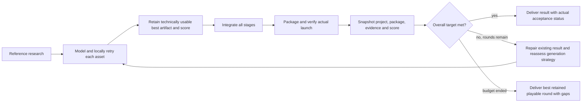

# Scored iteration delivery

The worker finishes and delivers usable rounds even when asset fidelity remains below target.
Delivery is distinct from acceptance: `DCC_PROVISIONAL`, `ENGINE_PROVISIONAL` and
`DELIVERED_WITH_GAPS` retain the original requirements, negative checks and repair instructions.
The control result can complete a delivery while explicitly reporting `qualityAccepted:false`.

The default target is 85/100. Scores measure observed criterion coverage, not subjective
similarity probabilities. Overall scoring uses the lowest of explicit criterion coverage,
applicable quality dimension coverage, mean asset coverage and mean observed stage coverage.
Unresolved technical/report issues require another round even above that score. Fully accepted
means all gates passed; reaching the score threshold does not relabel individual gaps.

Each completed round preserves the whole project, relative evidence paths and complete package
under the task's `production-state/.../deliveries/iteration-N/project` directory. Intermediate
build/cache directories are excluded. Files are hashed, later rounds cannot overwrite them, and
the best score survives subsequent regressions, failures and resumption. Durable records track
execution attempts separately from complete production iterations. Missing/unlaunchable packages
still trigger bounded repair; cancellation and unconfirmed process shutdown still stop execution.

Default budgets for new tasks:

| Stage | Timeout | Retry/iteration budget |
| --- | --- | --- |
| Intake / engineering / reference research | 20 min per call | 2 calls |
| Modeling author, shared blockout and final | 60 min per attempt | 3 direct attempts per production round |
| Generated-model cleanup | 15 min per attempt | 2 attempts per round |
| Modeling visual review | 20 min per call | 4 schema/service repair calls; first valid review is final |
| Modeling technical runner | 15 min per call | 3 calls |
| Whole-game quality review / iteration monitor | 20 min | 10 additional complete rounds; monitor 6 repeated / 24 total failures |

Existing task deadlines and pinned releases remain authoritative. These defaults do not reset
old task budgets, silently migrate frozen toolchains or re-submit unknown provider requests.
Provider generation remains optional, capability checked and subject to its durable submission
ledger. A completed deficient round can re-evaluate generation using its actual quality history.

## Retained shrine evidence

Task `task-8fa424e7-f33f-4fcb-9865-db2175b9e4a4`, workspace
`workspace-7a0611c3-8760-4252-8932-c5dfd2c303b6`, stopped after one author timeout and two
visual GAP reviews for `shrine-architecture-kit`. The third attempt had packed textures and
ten supplemental views, but the reviewer received only the five standard captures. Engineering
unknowns and self-check reports were also omitted. Source imagery for 1:1 matching was absent.

The new independent Blender recheck measured 41 valid reimported FBX proxies and generated six
identical-camera LOD views. A real independent review with the additional evidence passed four
of eight original criteria (50/100): module separation, closed/open geometry, convex collision,
and documented unknown room layout. Original reference fidelity, seam fixtures, material matching
and LOD2 seam retention remain GAP. No original task artifact or budget was modified.

Evidence: `D:/StoneWorker/modeling-v2-audit/quality-20260928/live-3/probe-report.json`.
Reference retrieval failures (HTTP 402/403 and unavailable pixels) are retained in `live-2`;
`live-3` explicitly replays that recorded blocker and demonstrates continuation through real
Blender checks and review, without inventing reference images.

## Verification

Node regressions cover provisional asset continuation, other assets completing after a GAP,
no budget reset on resume, next-round source repair, optional generation escalation, immutable
project/package snapshots, lower-score regression, report-gap repair and best-result delivery.
Real Blender fault injection checks missing/wrongly bound proxies, missing LODs and identical
comparison cameras. The original shrine source/export hashes remain unchanged after inspection.

`modeling-intake-probe.mjs --mode acceptance --seed-project ... --inject-stage-gap STAGE_ID`
runs the actual Windows host load/launch checks on an isolated retained project, injects one
report gap in round one and restores its original evidence in round two. This checks iteration
delivery and recovery; it is not a claim that the full shrine game has been built or accepted.
