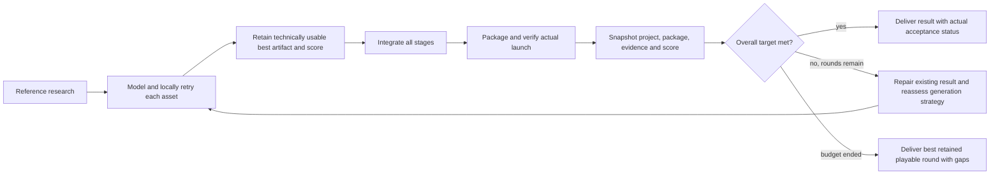

# Scored iteration delivery

The worker finishes and delivers usable rounds even when asset fidelity remains below target.
Delivery is distinct from acceptance: `DCC_PROVISIONAL`, `ENGINE_PROVISIONAL` and
`DELIVERED_WITH_GAPS` retain the original requirements, negative checks and repair instructions.
The control result can complete a delivery while explicitly reporting `qualityAccepted:false`.

The default target is 85/100. Scores measure observed criterion coverage, not subjective
similarity probabilities. Overall scoring uses the lowest of explicit criterion coverage,
applicable quality dimension coverage, mean asset coverage and mean observed stage coverage.
Unresolved technical/report issues require another round even above that score. Fully accepted
means all gates passed; reaching the score threshold does not relabel individual gaps.

Each completed round preserves the whole project, relative evidence paths and complete package
under the task's `rounds/<identity-prefix>/N` directory; its ledger and reports are under
`production-state/`. The shallow project path avoids Windows DLL loader length limits.
Intermediate build/cache directories and mutable package runtime logs are excluded. Files are hashed, later rounds cannot overwrite them, and
the best score survives subsequent regressions, failures and resumption. Durable records track
execution attempts separately from complete production iterations. Missing/unlaunchable packages
still trigger bounded repair; cancellation and unconfirmed process shutdown still stop execution.

Default budgets for new tasks:

| Stage | Timeout | Retry/iteration budget |
| --- | --- | --- |
| Intake / engineering | 20 min per call | 4 calls per production round |
| Reference research | 20 min per call | 2 calls |
| Modeling author, shared blockout and final | 60 min per attempt | 3 direct attempts per production round |
| Generated-model cleanup | 15 min per attempt | 2 attempts per round |
| Modeling visual review | 20 min per call | 4 schema/service repair calls; first valid review is final |
| Modeling technical runner | 15 min per call | 3 calls |
| Whole-game quality review / iteration monitor | 20 min | 10 additional complete rounds; monitor 6 repeated / 24 total failures |

Existing task deadlines and pinned releases remain authoritative. These defaults do not reset
old task budgets, silently migrate frozen toolchains or re-submit unknown provider requests.
Provider generation remains optional, capability checked and subject to its durable submission
ledger. A completed deficient round can re-evaluate generation using its actual quality history.

Planning uses the same delivery rule before any authored model exists. Exhausted internal intake
or engineering calls retain a `PLANNING_PROVISIONAL` handoff with the unchanged objective, any
valid intake draft, raw failed responses and exact field findings. It never becomes an accepted
contract or invents capsule/dimension defaults. Production completes the round using documented
temporary engine-native representations, records the gap and actual measurements, then repairs
planning in the next completed production round. Same-round resume makes no additional calls.
Successful intake is hashed and reused while engineering is repaired. Cancellation, unconfirmed
process termination, changed evidence and explicit invalid user specifications remain fenced.

`MODELING_INTAKE_MAX_CALLS` configures 1–12 calls for new tasks (default 4), independently of the
20-minute `MODELING_INTAKE_TIMEOUT_MS` (maximum 60 minutes). Both are pinned in task policy.

## Engineering planning exhaustion on 2026-09-28

Task `task-22fc67e2-2d8c-4db9-81d6-b22f1bc641d5`, workspace
`workspace-cb5720c6-81f5-46c5-9f84-e3d03388baf6`, did not time out in a visual review. Intake
repaired a pivot error and completed. Both engineering responses included the shared capsule
and paths for the shrine kit and entrance door, but left `contract.dimensions.meters:null`.
The planner confused immutable known pivots with unknown dimensions and original-game fidelity;
its generic validation feedback did not identify the missing field. Two calls exhausted the
old limit before any assets or playable package were created. This branch still threw globally.

Validation now identifies the missing extent directly and asks the responsible agent to record
project design extents without claiming original measurements. The known pivot stays unchanged.
Even if internal repairs exhaust, the new planning handoff keeps the round progressing and
retains the full failure evidence. Original task files and consumed budgets are not rewritten.

Verification for this repair:

- All 190 Node regressions passed, including planning exhaustion, same-round resume without
  additional calls, next-round engineering repair, immutable evidence, and rejecting asset
  removal across repeated intake repair rounds.
- An isolated replay of the actual failed response followed by one real engineering-agent call
  passed engineering validation. All seven assets, four objective requirements, original asset
  requirements, LOD budgets and known pivots were retained. The agent supplied documented
  project design extents; these are not verified original-game measurements. The subsequent
  reference-research step completed with its actual blockers recorded. Total probe: 485.7 s.
- An isolated real Windows project underwent eight injected engineering service failures across
  two complete rounds. Both rounds delivered with recorded gaps (93/100), both Unreal loads
  and package launches passed, and the retained best package also launched successfully.
  Total probe: 77.9 s. This tests delivery under internal planning failure, not shrine acceptance.

Evidence is under `D:/StoneWorker/modeling-v2-audit/planning-20260928/`: `node-tests-final.log`,
`live-repair/engineering-repair-report.json`, `live-repair/probe-report.json`, and
`windows-planning-gap/probe-report.json`. Both probe reports confirm the original production
context was unchanged. The failed production task was not resumed under a changed toolchain.

## Retained shrine evidence

Task `task-8fa424e7-f33f-4fcb-9865-db2175b9e4a4`, workspace
`workspace-7a0611c3-8760-4252-8932-c5dfd2c303b6`, stopped after one author timeout and two
visual GAP reviews for `shrine-architecture-kit`. The third attempt had packed textures and
ten supplemental views, but the reviewer received only the five standard captures. Engineering
unknowns and self-check reports were also omitted. Source imagery for 1:1 matching was absent.

The new independent Blender recheck measured 41 valid reimported FBX proxies and generated six
identical-camera LOD views. A real independent review with the additional evidence passed four
of eight original criteria (50/100): module separation, closed/open geometry, convex collision,
and documented unknown room layout. Original reference fidelity, seam fixtures, material matching
and LOD2 seam retention remain GAP. No original task artifact or budget was modified.

Evidence: `D:/StoneWorker/modeling-v2-audit/quality-20260928/live-3/probe-report.json`.
Reference retrieval failures (HTTP 402/403 and unavailable pixels) are retained in `live-2`;
`live-3` explicitly replays that recorded blocker and demonstrates continuation through real
Blender checks and review, without inventing reference images.

## Verification

Node regressions cover provisional asset continuation, other assets completing after a GAP,
no budget reset on resume, next-round source repair, optional generation escalation, immutable
project/package snapshots, lower-score regression, report-gap repair and best-result delivery.
Real Blender fault injection checks missing/wrongly bound proxies, missing LODs and identical
comparison cameras. The original shrine source/export hashes remain unchanged after inspection.

`modeling-intake-probe.mjs --mode acceptance --seed-project ... --inject-stage-gap STAGE_ID`
runs the actual Windows host load/launch checks on an isolated retained project, injects one
report gap in round one and restores its original evidence in round two. This checks iteration
delivery and recovery; it is not a claim that the full shrine game has been built or accepted.

Windows verification on 2026-09-28:

- The main implementation (`20a514a`) passed 186 Node regression tests, syntax checks for
  43 JavaScript and 22 Python files, and the real Blender export evidence fault-injection probe.
- Retained-project path handling (`e0afac9`) passed nine focused snapshot/quality tests.
  The first deep snapshot exposed a Windows DLL loader path-length failure; shallow snapshot
  directories fixed it, and the acceptance probe now launches the retained package too.
- The final real Windows acceptance probe completed in 61.5 seconds: round one recorded the
  injected stage gap and delivered at 93/100; round two restored the evidence and reached
  100/100. Both Unreal project loads, both package launches and the retained package launch
  exited successfully. The seed project's production context was unchanged.

The final report is
`D:/StoneWorker/modeling-v2-audit/quality-20260928/windows-iterations-short/probe-report.json`.
The earlier failing snapshot launch is retained under `windows-iterations/` for comparison.
