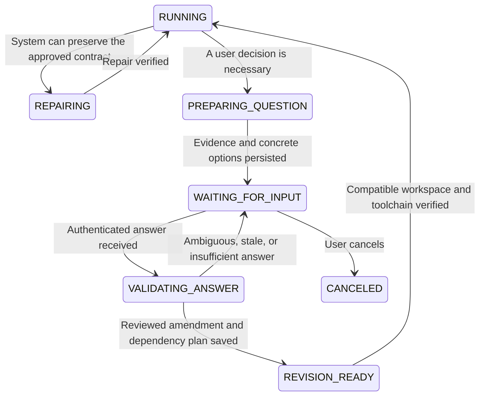

# Production decisions and resumable questions

Status: implemented in worker, controller and web, with API/worker/browser regression
coverage. Deployment and retained-task readiness must be verified separately using the
rollout steps below; this document does not claim that a live controller is upgraded.

## Outcome

When progress requires a user decision, show an actionable question and retain the
workspace. Do not repeatedly produce an unchanged package, silently weaken a contract,
or require the user to reconstruct the problem from logs. A stopped worker execution
does not mean that the user's task or iteration budget has been exhausted.

## Decide who can resolve the blocker

| Blocker | Owner and next action | Ask the user? |
| --- | --- | --- |
| Validator applies several assembly poses to one static pose; concept reviewer demands animation proof from a still image | Harness defect: repair the validator/stage assignment, recheck the retained artifact | No; report repair progress and any operator dependency |
| Timeout, unavailable service, malformed tool response | Bounded recovery of the same operation, then an operator-facing diagnostic | Only if a real product choice remains; never ask for credentials or technical guesswork |
| Proposed change to an approved appearance, dimension, reference, cost, or acceptance scope | Explain the exact before/after and consequences; wait for a decision | Yes |
| Provider rejects generation input | Preserve actual prompt, selected reference identities, input hash, provider code and request ID; stop unchanged submissions | Yes, when a meaningful input revision or scope change is required |
| Source is correct but cannot satisfy two retained requirements simultaneously | Present the conflict and concrete alternatives supported by measurements | Yes |
| Quality gap with a known repair that preserves the contract | Repair within the authorized task and existing ledger | No |

Do not turn every failure into a question. A user cannot repair a broken validator by
approving an unrelated visual change. Missing measurements require investigation before
asking; estimates must not be presented as provider findings or verified measurements.

## Question contents

Use one stable request per unresolved decision, containing:

- `protocol`, `requestId`, `taskId`, `revisionId`, `runId`, `assetIds`, and `stage`.
- `kind`: `contract-conflict`, `visual-revision`, `generation-input-rejected`, or
  `scope-choice`. Infrastructure failures remain a separate repair state.
- `title`, plain-language `reason`, the measured `actual`, approved `expected`, and
  evidence references with content hashes. The original technical report remains available.
- Two or three concrete `options`, each with a stable ID, consequences, a complete
  proposed amendment, retained obligations, and optional recommendation. No option is
  submitted automatically, including a recommended or visually preselected option.
- A free-text answer field. Generation refusals also provide an editable **complete**
  visual brief and the references actually used, rather than only a request to remove a word.
- `basePlanHash`, `effectiveInputHash`, and the relevant dependency hashes. These identify
  the facts the user is approving and detect stale answers.
- `waitingPolicy`: no polling of the provider, no new author call for the blocked asset,
  no iteration charge for waiting, no inference of approval from a timeout. Independent
  useful work may finish before the worker releases its allocation.

Do not guess the sensitive word or legal reason from a moderation code. Offer acceptable
subject/design/reference changes and removal of accidentally included historical text.
Do not obfuscate rejected subject matter or change providers to defeat their content review.
Every revised request still undergoes the provider's checks.

## State and delivery

The controller owns the pending request and answer. The worker atomically checkpoints
first, publishes the request, then releases its execution/allocation. The UI displays
“Waiting for your answer”, the affected assets and question card at the top of the task.
This is not a quality PASS, completed delivery, generic FAILED banner or exhausted-budget
message. The last working package remains explicitly labeled as a previous revision.

Prefer a controller task substate (`inputRequest.status`) over changing all job lease
states at once. A settled job can remain settled while the task displays its pending
decision. Task detail/list, events, run summaries and Continue must use the same substate.
Legacy clients still receive a complete human-readable reason and attached question report.

Publication is acknowledged and idempotent. If the controller is temporarily unavailable,
retain the unsent request and retry publication only; never repeat generation to obtain the
same refusal. A worker crash after publication cannot create a duplicate question.

## Answer and resume transaction

1. The answer endpoint verifies task ownership, request ID, revision, base plan hash,
   answer size and an idempotency key. A stale answer returns the current question without
   activating an obsolete amendment. Two simultaneous answers cannot both activate.
2. Selecting an option accepts its displayed amendment only. A free-text answer is parsed
   into a proposal, validated against the current contract, and independently reviewed.
   Ambiguity produces a focused follow-up question before any dependent work starts.
3. Archive the question, answer, old plan and proposed diff. Apply only expressly authorized
   fields. Update the active engineering projection and model specification together;
   historical plans and pins remain immutable. Ordinary author feedback cannot amend them.
4. Build a dependency/invalidation plan. Revalidate existing usable sources first. A
   dimension change does not automatically require regenerating a successful concept or
   replacing a correctly rigged source. Mark affected exports, engine bindings, traversal,
   gameplay and package acceptance for fresh verification as appropriate.
5. For a generation revision, compute identity from the **effective** prompt and actual
   reference contents. A new revision ID, asset label or metadata edit alone cannot clear
   a cached rejection. If the effective rejected input is unchanged, keep the question
   open and explain exactly what still needs revision without calling the provider.
6. Record a controller-owned revision and any explicitly granted budget separately from
   consumed budgets. Waiting, re-answering or reloading the page resets no counters. Restore
   work only after the retained workspace, current epoch and toolchain pass resume checks.
7. On success, resolve the question and show which asset and requirements changed. A new
   refusal or genuinely different conflict creates a linked successor with new evidence;
   the same unresolved conflict reuses its existing request.

Plain “continue”, a blank answer, a recommendation, silence and elapsed time are not
authorization to change requirements. A broad appearance approval cannot alter dimensions,
rigging, source provenance or engine verification. Already accepted answers persist across
restarts and should not be asked again for the same reviewed amendment.

## Interface work and rollout

Worker: bounded blocker summaries, immutable question reports, checkpoint/publication,
effective-input identity, reviewed amendment application, retained-source revalidation.

Controller: authenticated pending-request publication and answer endpoints; transactional
ownership/staleness/idempotency checks; revision and budget linkage; task/event projections.

Web: question card with radio choices and free text, complete prompt/reference editor where
applicable, explicit Submit answer, validation feedback, previous-package labeling, and
pending-answer persistence across refreshes. Show report links adjacent to the decision.

Deploy the controller's backward-compatible protocol and web rendering before enabling
worker question publication. Use capability negotiation; an older controller receives the
legacy actionable report and Continue template, with the limitation reported explicitly.
Do not claim that a report attachment alone implements the interactive waiting workflow.

## Required verification

- Genuine geometry/validator defects enter repair, not user approval or contract relaxation.
- Approved dimension amendment changes only the chosen axis/tolerance and revalidates an
  existing source; unapproved values, rig removal and unrelated assets are rejected.
- Same rejected prompt/reference content across revisions invokes the provider zero extra
  times; substantive revised content gets a new immutable input record and provider check.
- Waiting, double submission, restart and page refresh preserve answers, artifacts, pins
  and consumed budgets; no automatic answer or duplicate revision is created.
- Expired/stale request, wrong owner, simultaneous answers, lost publication acknowledgement
  and unsupported controller versions have deterministic, recoverable outcomes.
- Browser test: visible expected/actual evidence, no selection auto-submit, free-text repair,
  answer validation, resumed progress, and accurate previous/current package labeling.
- End-to-end acceptance remains required: a passed concept, technical source or question
  resolution alone cannot mark engine integration or the playable task completed.

## Implemented protocol and rollout

The worker persists an immutable question under the task's `decision-state/`, with a
hashed evidence file under `project/plan/user-decisions/`. The existing durable RESULT
journal carries `report.inputRequest` to `/v1/worker/step-result`. That transaction saves
the question, settles the execution and releases its allocation. The public task and run
status becomes `WAITING_FOR_INPUT`; the legacy internal execution remains settled FAILED.
It does not remain on a running lease or expire while waiting for an answer.

`POST /v1/tasks/:id/answer` requires the authenticated owner, CSRF token, request/revision/
plan/input identities, idempotency key, explicit option or complete text, selected existing
generation reference paths, and `grantNewBudget`. Answer and next revision commit together.
Repeating an acknowledged answer returns the same revision; a competing/stale answer gets
409. A plain continuation or unchanged rejected prompt/reference selection gets 422 and
creates no revision. Cancel preserves question history. Continue/recover cannot bypass a
pending question. The web card has no default selection, retains account/question-scoped
drafts in session storage, and downloads the actual input report directly from the stored
question. It supports retaining/removing existing generation references; attaching a new
reference file in this card is not implemented.

Before reserving another production attempt the worker verifies retained evidence, reviews
the answer, and applies modeling amendments through the existing independently reviewed
revision mechanism. Ambiguity creates a linked successor question. Crash recovery uses
the activation record and answer receipt, never reapplies an answered amendment or skips
a later pending question. Service/tool defects without an authored measured source do not
enter automatic preference classification. Orchestrator proposals require host review.

Answers inherit the original production and asset-author budget identity by default.
The unchecked budget option explicitly grants a separate revision allowance (3 author calls
per asset, 10 production iterations); global limits and retained service/provider ledgers
still apply. Waiting and invalid answers create no author/provider/production calls; the
bounded input reviews use their own durable review ledger. All historical consumption and
accepted artifacts remain intact. A revised brief can still be rejected by the provider;
that produces another question with new evidence, not an automatic retry.

For a deployment from Git:

1. On the controller, run `controller/deploy/deploy-controller.sh --repo <checkout> --ref main
   --dry-run`, then the same repository script without `--dry-run`. It applies migration
   `010_user_decisions.sql` and publishes `app/user-decisions.js`. Verify `/healthz` returns
   `capabilities.userDecisions: 1`. Record the exact controller commit.
2. Verify the worker is idle with no execution journal; set `runtime/config/autostart.paused`
   before stopping its idle process. Fast-forward the worktree to the committed target and
   use `worker/deploy/deploy-worker.ps1 -PrepareOnly`. Never edit the installed process files.
3. For each affected compatible retained task, use `worker/tools/migrate-workspace.mjs`
   `plan`, review the returned plan and predecessor epoch, then `stage` and `apply` with that
   exact `--expect-plan-hash`. Finish with `resume-check`. Preserve legacy incompatible
   workspaces without claiming them ready; do not reset their pins or consumed budgets.
4. Remove the pause marker only when the committed release and intended retained tasks are
   ready. Start `YahahaGame-Worker-Autostart`, run `register-worker-autostart.ps1 -CheckOnly`,
   and inspect a fresh `monitor-worker.ps1 -Once -Json`: one worker, correct commit and
   capability, fresh heartbeat. A logged-in desktop is still required for Unreal workflows.
5. Continue the existing task from the web. Historical failures are not fabricated into
   new questions; the next worker assessment publishes grounded questions where necessary.

Controller poll responses advertise support per job; new workers preserve the legacy
actionable report with old controllers. Answer revisions require `userDecisions: 1` on the
worker, so an old worker cannot claim them. Question/result replay is idempotent even if
the acknowledgement was lost. Code verification alone is not deployment acceptance.
